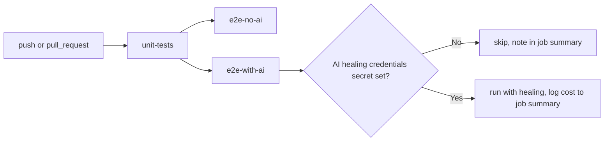
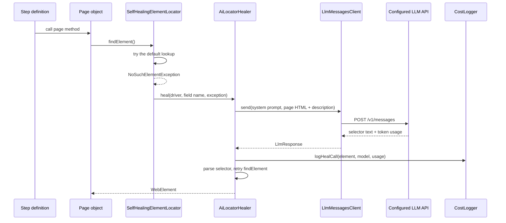

# Playbook

This is the deep-dive doc. If you just want to run the tests, see
`README.md`. If you're deciding whether to build on this framework,
extend it, or wire it into your own pipeline, keep reading.

## Why the module split

`framework` and `example-tests` are separate Maven modules, not just
separate packages, because a conceptual boundary that isn't enforced
by the build tends to erode - someone adds one convenient import
across the line and the "reusable library" claim stops being true.
With a real module boundary, `example-tests` can only see what
`framework` exposes as public API, the same as any other consumer
would.

## SOLID, concretely

| Principle | Where | Why |
|---|---|---|
| Single Responsibility | `DriverManager` owns driver lifecycle; `Setup` only creates a driver; `TearDown` only tears one down | each class has exactly one reason to change |
| Single Responsibility | `AiLocatorHealer` orchestrates; `ClaudeMessagesClient` does HTTP; `SelectorResponseParser` parses; `JsonEscaping` encodes | each piece is testable and changeable independently, none of them need a live network call to verify |
| Open/Closed | `ModelPricing` is a lookup table, not an if/else chain | adding a model is a one-line map entry, no existing code path changes |
| Liskov Substitution | `AiElementLocatorFactory` and Selenium's `DefaultElementLocatorFactory` both implement `ElementLocatorFactory` | `BasePage` works with either without knowing which one it got |
| Interface Segregation | `ClaudeMessagesClient` exposes exactly the one method callers need | nothing depends on HTTP internals it doesn't use |
| Dependency Inversion | `BasePage` depends on the `ElementLocatorFactory` interface, not a concrete class | the locator strategy can change without touching `BasePage` |

## Depending on `framework` from another repo

Install it locally first:

```
./mvnw -pl framework -am install
```

Then reference it the normal Maven way from your own `pom.xml`:

```xml
<dependency>
    <groupId>com.cucumberbddparallel</groupId>
    <artifactId>framework</artifactId>
    <version>1.0-SNAPSHOT</version>
</dependency>
```

What you get:

- `com.cucumberbddparallel.framework.driver.DriverManager` - thread-local
  `WebDriver` storage. `get()` returns the current thread's driver or
  throws if `Setup`'s `@Before` hook hasn't run yet; `quit()` tears it
  down and clears the thread-local.
- `com.cucumberbddparallel.framework.driver.Setup` / `TearDown` - drop
  these into your runner's `glue` array and you get browser lifecycle
  management (including failure screenshots) without writing it
  yourself.
- `com.cucumberbddparallel.framework.wait.Wait` - three explicit-wait
  helpers: page load, element visibility, presence of a list of
  elements.
- `com.cucumberbddparallel.framework.page.BasePage` - extend this for
  page objects. It wires up `@FindBy` fields via Selenium's
  `PageFactory`, choosing between the default locator and the AI
  healing one automatically based on whether AI is configured.

## The AI cost model

### Pricing table

`com.cucumberbddparallel.framework.ai.cost.ModelPricing` holds:

| Model | Input $/M tokens | Output $/M tokens |
|---|---|---|
| claude-opus-4-8 | 15.00 | 75.00 |
| claude-sonnet-5 | 3.00 | 15.00 |
| claude-haiku-4-5 | 0.80 | 4.00 |

These are a snapshot at the time this table was written, not live
data - check https://www.anthropic.com/pricing before relying on them
for real budget planning, and update the table when they change.

### Why Sonnet is the default

Healing a locator is "read this HTML, return one CSS selector" - not
a task that benefits much from Opus's extra reasoning depth. Sonnet
costs a fifth of Opus per token and handles this fine. Override with
`ANTHROPIC_MODEL=claude-opus-4-8` if you're healing against
unusually complex or ambiguous markup and want the strongest model
available.

### Reading cost locally

Every healing call logs one line through SLF4J:

```
AI locator heal: element=searchInput model=claude-sonnet-5 in=1842 out=12 cost=$0.005706
```

A shutdown hook logs the running total for the JVM when the process
exits:

```
AI locator healing session total: $0.005706
```

### Reading cost in CI

The `e2e-with-ai` job in `.github/workflows/ci.yml` pipes its Maven
output through `grep` for these two log line patterns and writes them
into the job's `$GITHUB_STEP_SUMMARY`, so the dollar cost of that
pipeline run shows up directly on the Actions run summary page - no
need to dig through the full log.

Rough monthly cost at scale: if a pipeline heals N locators per run
and runs M times a day, monthly cost is roughly
`N * M * 30 * (average cost per heal)`. At Sonnet rates, a typical
heal (roughly 2,000 input tokens of page HTML, a few dozen output
tokens) costs well under a cent - the real cost driver is how often
your markup actually changes, not the per-call price.

### Turning it off entirely

No provider credentials in the environment means healing never
activates - `AiConfig.isHealingEnabled()` returns `false` and
`BasePage` uses Selenium's plain `DefaultElementLocatorFactory`.
Configure `AI_HEALING_PROVIDER` plus BYOK keys, or `AI_HEALING_PROVIDER=ollama`
for local Ollama. See `docs/AI_HEALING.md`. If credentials are present
but you want to force healing off (e.g. a CI job that has secrets for
other jobs), pass `-Dai.healing.enabled=false`.

## CI

Three jobs in `.github/workflows/ci.yml`:



- **unit-tests** - `framework`'s JUnit 5 suite. No browser, no
  network, fast. Gates the other two jobs.
- **e2e-no-ai** - the example suite against google.com with no API
  key present. Proves the framework works standalone.
- **e2e-with-ai** - same suite, with AI healing credentials from a repo
  secret (`ANTHROPIC_API_KEY` or unified `AI_HEALING_*` vars). Skips
  itself gracefully when the secret isn't configured, so forks without
  the secret don't get a red X for something outside their control.

## How a healing call actually works end to end



If the retried lookup also fails, the original
`NoSuchElementException` is rethrown with the healing failure attached
as a suppressed exception - you still get the original stack trace,
plus what the AI tried.

## Extending the framework

- **New page object** - extend `BasePage`, same as `HomePage` and
  `SearchResultPage` do in `example-tests`. `@FindBy` fields get
  wired automatically.
- **New wait condition** - add a method to `Wait` following the
  existing `waitUntilCondition` pattern.
- **New locator strategy beyond AI/default** - `BasePage` currently
  picks between two `ElementLocatorFactory` implementations with a
  ternary. If a third strategy shows up, that's the point to
  introduce a small selection abstraction - not before, since two
  known cases don't justify it yet.

## Known rough edges

- `example-tests` runs against live google.com. It's a demo, not a
  correctness gate on the framework - Google changing their markup
  will break it independently of anything in this repo. Point it at
  your own AUT for real use.
- `ChromeDriver`/`GeckoDriver` versions come from WebDriverManager at
  runtime, so a CI run's browser version can drift over time. Pin a
  specific version in `Setup` if you need reproducible browser
  versions across runs.
