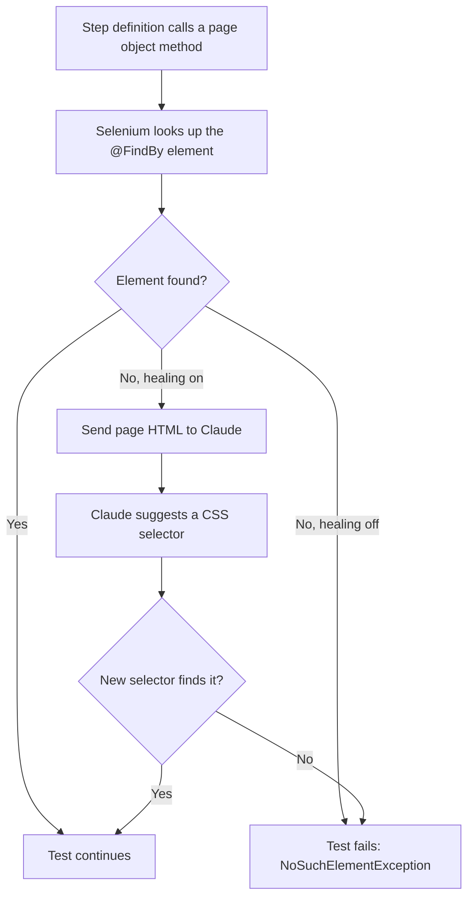

# cucumberBDDParallel

A Cucumber + Selenium 4 + TestNG framework for browser BDD tests, split
into two pieces. I built this the way I wish more test frameworks were
built: a small reusable core you can actually depend on, a real
working example instead of a toy one, and locators that don't need a
babysitter every time a page's markup shifts.

The two pieces:

- `framework/` - the reusable part: driver setup/teardown, explicit
  waits, a base page class, and an opt-in AI self-healing locator.
  Depend on this from your own test project the same way
  `example-tests` does.
- `example-tests/` - a working example against google.com, showing
  page objects, step definitions, feature files, and TestNG runners
  built on top of `framework`.

## Requirements

- JDK 21
- Maven 3.9+ (or just use the bundled `./mvnw`)

## Running the example tests

```
./mvnw clean verify -Pintegration-test -pl example-tests -am
```

Browser selection: `-Dbrowser=firefox` (defaults to `chrome`).

## AI self-healing locators

When a page's `@FindBy` locator can no longer find its element (e.g.
after a markup change), the framework can ask Claude for a
replacement CSS selector and retry once before failing the step.

This is **off by default** and only turns on when an API key is
present in the environment - never commit a key to source control:

```
export ANTHROPIC_API_KEY=sk-ant-...
export ANTHROPIC_MODEL=claude-sonnet-5   # optional, this is the default
./mvnw clean verify -Pintegration-test -pl example-tests -am
```

To force it off even with a key present: `-Dai.healing.enabled=false`.

Every healing call logs its token usage and dollar cost. Look for
lines like:

```
AI locator heal: element=searchInput model=claude-sonnet-5 in=1842 out=12 cost=$0.006126
AI locator healing session total: $0.006126
```

See `PLAYBOOK.md` for the pricing table, how CI surfaces this per
run, and how to change the default model.



## Using `framework` in your own project

Add it as a dependency once it's built or published:

```xml
<dependency>
    <groupId>com.cucumberbddparallel</groupId>
    <artifactId>framework</artifactId>
    <version>1.0-SNAPSHOT</version>
</dependency>
```

Then extend `com.cucumberbddparallel.framework.page.BasePage` for your
page objects, wire `com.cucumberbddparallel.framework.driver.Setup`
and `TearDown` into your runner's `glue`, and you get driver
management, waits, and optional AI healing for free. `example-tests`
is a working reference for exactly this setup.

## More detail

`PLAYBOOK.md` covers the architecture decisions, the SOLID reasoning
behind them, the full AI cost model, CI internals, and how to extend
the framework - written for someone who's going to build on this, not
just run it.
