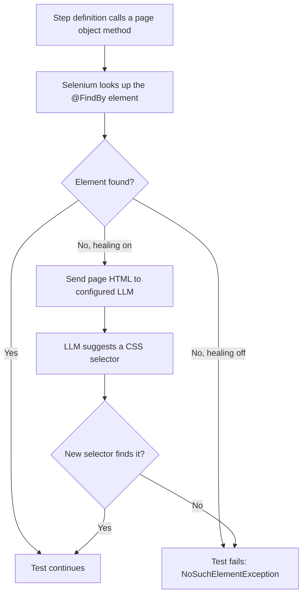

# cucumberBDDParallel

A Cucumber + Selenium 4 + TestNG framework for browser BDD tests, split
into two pieces. I built this the way I wish more test frameworks were
built: a small reusable core you can actually depend on, a real
working example instead of a toy one, and locators that don't need a
babysitter every time a page's markup shifts.

The two pieces:

- `framework/` - the reusable part: driver setup/teardown, explicit
  waits, a base page class, and an opt-in AI self-healing locator.
  Depend on this from your own test project the same way
  `example-tests` does.
- `example-tests/` - a working example against google.com, showing
  page objects, step definitions, feature files, and TestNG runners
  built on top of `framework`.

## Requirements

- JDK 21
- Maven 3.9+ (or just use the bundled `./mvnw`)

## Running the example tests

```
./mvnw clean verify -Pintegration-test -DskipTests -pl example-tests -am
```

Browser selection: `-Dbrowser=firefox` (defaults to `chrome`).

## AI self-healing locators

When a page's `@FindBy` locator can no longer find its element (e.g.
after a markup change), the framework can ask an LLM for a replacement
CSS selector and retry once before failing the step.

**You pick the route** — Anthropic BYOK, OpenAI-compatible BYOK (OpenAI,
Azure, gateways), or **local Ollama**. Nothing is locked to one vendor.

This is **off by default** until you configure a provider. Never commit
API keys to source control.

### Quick setup (pick one)

**Anthropic (BYOK, legacy env vars still work):**

```
export AI_HEALING_PROVIDER=anthropic
export AI_HEALING_API_KEY=sk-ant-...
export AI_HEALING_MODEL=claude-sonnet-5   # optional
```

**OpenAI or any OpenAI-compatible cloud API (BYOK):**

```
export AI_HEALING_PROVIDER=openai
export AI_HEALING_API_KEY=sk-...
export AI_HEALING_MODEL=gpt-4o-mini      # optional
# Optional custom gateway:
# export AI_HEALING_BASE_URL=https://my-gateway.example/v1
```

**Local Ollama (no cloud key):**

```
export AI_HEALING_PROVIDER=ollama
export AI_HEALING_MODEL=llama3.2         # must be pulled in Ollama first
# Optional if Ollama is not on localhost:11434
# export OLLAMA_HOST=http://127.0.0.1:11434
```

Then run tests as usual:

```
./mvnw clean verify -Pintegration-test -DskipTests -pl example-tests -am
```

To force healing off even when configured: `-Dai.healing.enabled=false`.

Every healing call logs token usage and cost (when the model is in the
pricing table). See `docs/AI_HEALING.md` and `PLAYBOOK.md` for full
env var reference, CI notes, and cost tracking.



## Using `framework` in your own project

Add it as a dependency once it's built or published:

```xml
<dependency>
    <groupId>com.cucumberbddparallel</groupId>
    <artifactId>framework</artifactId>
    <version>1.0-SNAPSHOT</version>
</dependency>
```

Then extend `com.cucumberbddparallel.framework.page.BasePage` for your
page objects, wire `com.cucumberbddparallel.framework.driver.Setup`
and `TearDown` into your runner's `glue`, and you get driver
management, waits, and optional AI healing for free. `example-tests`
is a working reference for exactly this setup.

## More detail

`PLAYBOOK.md` covers the architecture decisions, the SOLID reasoning
behind them, the full AI cost model, CI internals, and how to extend
the framework - written for someone who's going to build on this, not
just run it.

## Author

Built by [Veeresh Bikkaneti](https://veeresh-bikkaneti.github.io/techtalkwith-veeresh/)
at [RunTechCS](https://runtechcs.com).
