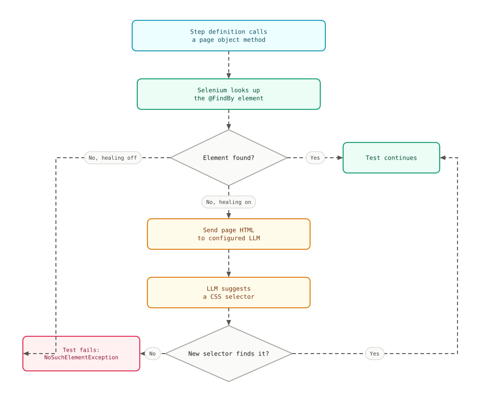

# cucumberBDDParallel

A Cucumber + Selenium 4 + TestNG framework for parallel browser BDD
tests, with an opt-in AI self-healing locator. I built this the way I
wish more test frameworks were built: a small reusable core you can
actually depend on, real working examples instead of toy ones, and
locators that don't need a babysitter every time a page's markup
shifts.

## What's inside

| Module | What it is |
|---|---|
| `framework/` | The reusable core: driver setup/teardown, explicit waits, a base page class, web-pattern helpers, and the opt-in AI self-healing locator. Depend on this from your own test project. |
| `example-tests/` | A working BDD suite against the self-contained example app (no live-site flake): Gherkin features, step definitions, page objects, TestNG runners, parallelized with Cucable. |
| `examples/example-app` | The demo web app the examples drive — an embedded HTTP server (JDK only, zero dependencies) with pages for search, tables, drag-drop, upload, login, and dynamic content. See [`docs/EXAMPLE_APP.md`](docs/EXAMPLE_APP.md). |
| `examples/ai-healing-demo` | Deterministic proof that locator healing works — a mock LLM for CI, plus live runs for Anthropic / OpenAI / Ollama. |
| `examples/web-patterns-demo` | Recipes for tricky web patterns with local fixtures: tables, HTML5 drag-drop, file upload/download, PDF text, QR decode, OCR. |

## Requirements

- JDK 21
- Maven 3.9+ (or just use the bundled `./mvnw` / `mvnw.cmd`)
- Chrome or Firefox for the browser suites. WebDriverManager downloads the matching
  driver binary on first run, so the machine needs internet access then; once cached
  (`~/.cache/selenium`), runs work offline.

## Quickstart

Run the framework unit tests (no browser needed):

```bash
./mvnw -pl framework -am test
```

Run the parallel example suite (headless Chrome via WebDriverManager):

```bash
./mvnw clean verify -Pintegration-test -Dheadless=true -pl example-tests -am
```

Pick a browser: `-Dbrowser=firefox` (default is `chrome`). Omit `-Dheadless=true`
on a machine with a display if you want to watch the browser.

Run the demos:

```bash
./mvnw -pl examples/ai-healing-demo -am test      # AI healing, mock LLM
./mvnw -pl examples/web-patterns-demo -am test    # web patterns, local fixtures
```

Run everything headlessly in Docker:

```bash
docker compose build && docker compose run --rm cucumber-examples
```

## AI self-healing locators

When a page's `@FindBy` locator can no longer find its element (e.g.
after a markup change), the framework can ask an LLM for a replacement
CSS selector and retry once before failing the step.

**You pick the route** — Anthropic BYOK, OpenAI-compatible BYOK, or
**local Ollama**. Nothing is locked to one vendor. Healing is **off by
default** until you configure a provider, and no API keys belong in
source control.

```bash
export AI_HEALING_PROVIDER=anthropic   # or: openai, ollama
export AI_HEALING_API_KEY=sk-ant-...
./mvnw clean verify -Pintegration-test -Dheadless=true -pl example-tests -am
```

Force healing off even when configured: `-Dai.healing.enabled=false`.

Every healing call logs token usage and cost; a session total is
logged at JVM exit. Full provider setup, the env var reference, and
cost tracking: [`docs/AI_HEALING.md`](docs/AI_HEALING.md).



## Using `framework` in your own project

Build and install it locally:

```bash
./mvnw -pl framework -am install
```

Then depend on it like any other library:

```xml
<dependency>
    <groupId>com.cucumberbddparallel</groupId>
    <artifactId>framework</artifactId>
    <version>1.0-SNAPSHOT</version>
</dependency>
```

Extend `com.cucumberbddparallel.framework.page.BasePage` for your page
objects, wire `com.cucumberbddparallel.framework.driver.Setup` and
`TearDown` into your runner's `glue`, and you get driver management,
waits, and optional AI healing for free. `example-tests` is a working
reference for exactly this setup.

## Docs

| Doc | For |
|---|---|
| [`docs/ARCHITECTURE.md`](docs/ARCHITECTURE.md) | Module map, parallel execution flow, scenario lifecycle, healing sequence, provider abstraction, CI and Docker topology — with diagrams |
| [`docs/EXAMPLE_APP.md`](docs/EXAMPLE_APP.md) | The self-contained example app: routes, element IDs, server lifecycle, and which feature demonstrates which framework capability — with diagrams |
| [`docs/AI_HEALING.md`](docs/AI_HEALING.md) | Provider setup, full env var reference, reliability behavior, cost tracking, troubleshooting |
| [`PLAYBOOK.md`](PLAYBOOK.md) | Architecture decisions, SOLID reasoning, the AI cost model, CI internals, extending the framework |
| [`docs/MCP_PLAYBOOK.md`](docs/MCP_PLAYBOOK.md) | Driving the fixtures with an MCP Selenium agent for exploration |
| [`examples/ai-healing-demo/README.md`](examples/ai-healing-demo/README.md) | Mock vs live healing demo runs |
| [`examples/web-patterns-demo/README.md`](examples/web-patterns-demo/README.md) | Web pattern recipes |

## Author

Built by [Veeresh Bikkaneti](https://veeresh-bikkaneti.github.io/techtalkwith-veeresh/)
at [RunTechCS](https://runtechcs.com).
