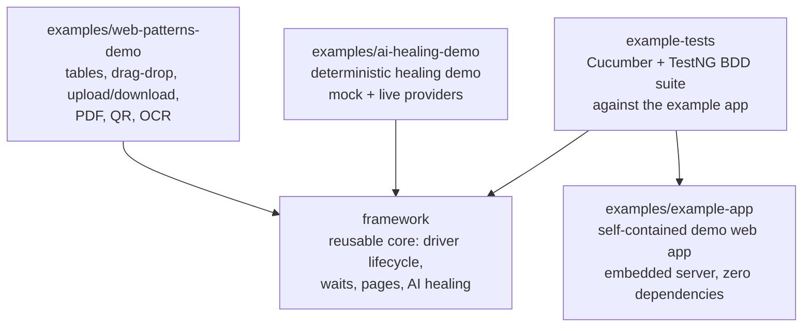
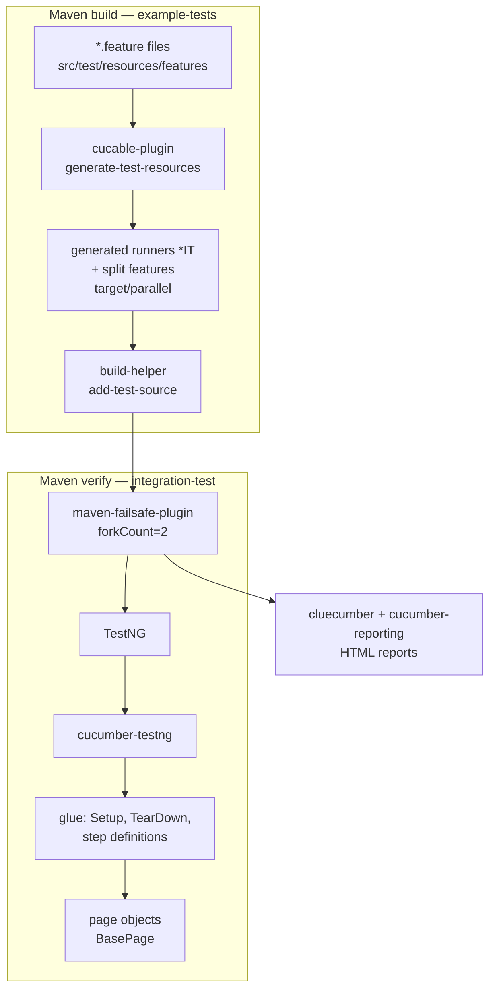
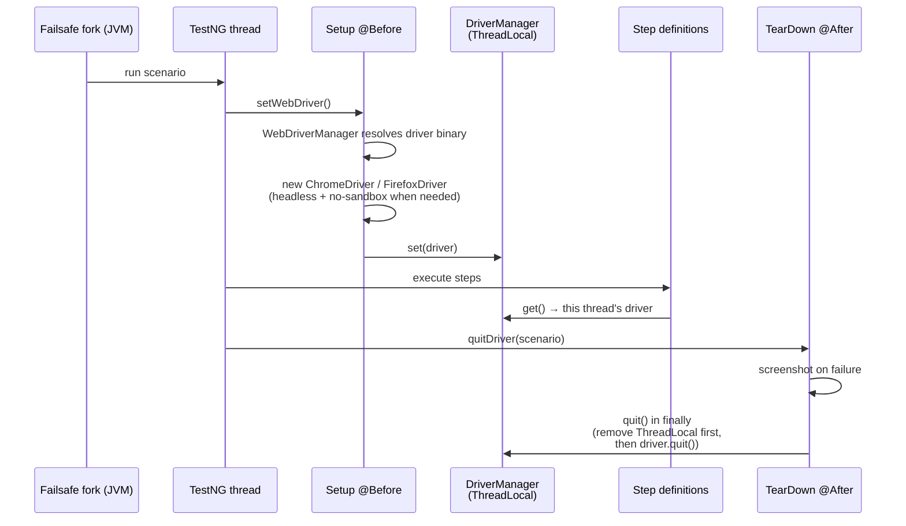
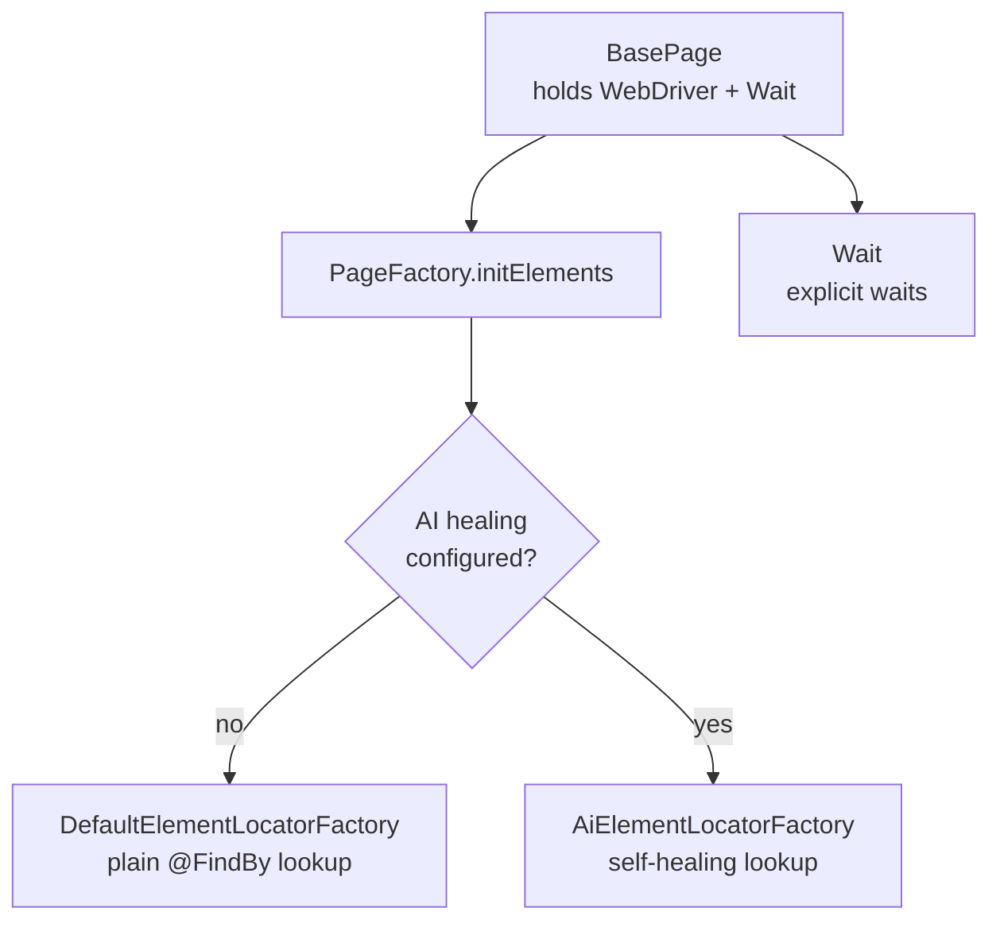
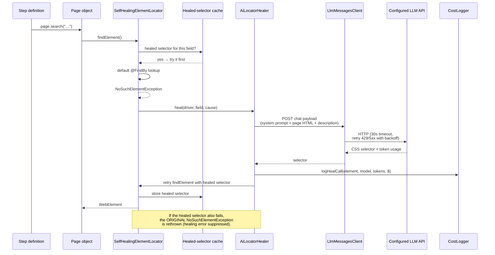
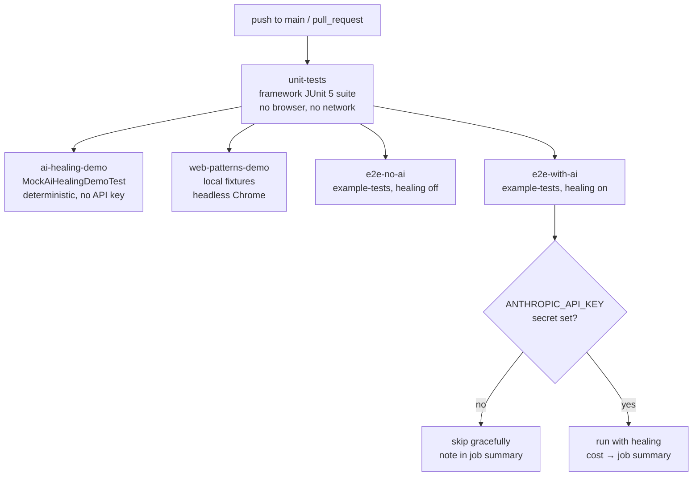
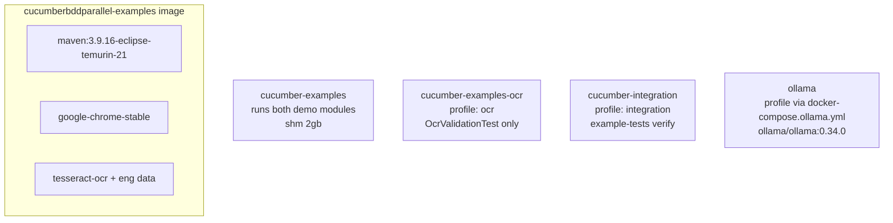

# Architecture

How `cucumberBDDParallel` is put together, how tests flow through it in
parallel, and where the AI self-healing fits in. If you just want to run
things, start with the [README](../README.md). If you want the reasoning
behind the design decisions, see the [Playbook](../PLAYBOOK.md).

## Module map

Five Maven modules. One rule: **everything depends on `framework`;
`example-tests` also depends on the `example-app` it drives;
nothing else depends on anything.**



| Module | Packaging | Depends on | Purpose |
|---|---|---|---|
| `framework` | jar | Selenium, Cucumber, TestNG, WebDriverManager, SLF4J | The reusable library. Driver lifecycle, explicit waits, base page, opt-in AI healing locator, cost tracking. |
| `example-tests` | jar (test code) | `framework`, `example-app` | A real BDD suite: Gherkin features, step definitions, page objects, TestNG runners — parallelized with Cucable. The app-under-test is `example-app` (see [EXAMPLE_APP.md](EXAMPLE_APP.md)). |
| `examples/example-app` | jar | none (JDK only) | The self-contained demo web app the examples drive: embedded `HttpServer`, teaching pages for search, tables, drag-drop, upload, login, dynamic content. Full route table in [EXAMPLE_APP.md](EXAMPLE_APP.md). |
| `examples/ai-healing-demo` | jar (test code) | `framework` | Proves locator healing works: a deliberately broken `@FindBy`, a mock LLM for CI, live runs for Anthropic/OpenAI/Ollama. |
| `examples/web-patterns-demo` | jar (test code) | `framework` | Tricky-web-pattern recipes with local fixtures: tables, HTML5 drag-drop, file upload/download, PDF text, QR decode, OCR. |

The module boundary is deliberate: `example-tests` can only use what
`framework` exposes publicly, exactly like any external consumer.

## How a parallel run flows

`example-tests` parallelizes with [Cucable](https://github.com/trivago/cucable-plugin):
each feature file becomes its own generated TestNG runner, and Maven
Failsafe runs those runners across forked JVMs.



Hand-written runners (`*Test` in the `runner` package) are **excluded
from Surefire** — they exist for IDE runs. Only the Cucable-generated
`*IT` runners execute under Failsafe, so nothing runs twice and
nothing runs zero times.

## One scenario, one browser, one thread

Parallelism is built on a `ThreadLocal<WebDriver>`. Each scenario gets
a fresh browser on its own thread; threads never share drivers.



Failure safety is the point of the `finally`: even if screenshotting
throws, the browser is quit and the thread-local is cleared, so the
next scenario on a pooled thread never inherits a dead driver.

```mermaid
flowchart TD
    subgraph thread [One TestNG thread]
        TL[ThreadLocal slot]
        D1[ChromeDriver A]
        D2[ChromeDriver B]
        TL -.->|scenario 1| D1
        TL -.->|scenario 2| D2
    end
    note[quit() clears the slot<br/>before closing the browser]
```

## Page objects and waits



- `BasePage` is the superclass for all page objects. It wires `@FindBy`
  fields through Selenium's `PageFactory`, picking the locator factory
  based on whether AI healing is configured.
- `Wait` wraps `WebDriverWait` with explicit-wait helpers that return
  the found element(s), so callers never re-find and race with stale
  elements.
- `TableHelper`, `DragDropHelper`, `FileUploadHelper` cover the
  awkward web patterns (grids, HTML5 drag-drop via injected
  `DataTransfer` events, hidden file inputs).

## AI self-healing, end to end

When a `@FindBy` locator stops matching (markup changed), the healing
locator asks a configured LLM for a replacement CSS selector, retries
once, and caches the healed selector so a page with many broken
locators doesn't re-bill the same fix.



Design points worth knowing:

- **Healing is off by default.** No provider credentials in the
  environment → `AiConfig.isHealingEnabled()` is `false` → plain
  `DefaultElementLocatorFactory`. Nothing phones home.
- **The original exception always wins.** If the LLM is unreachable or
  its selector is invalid, you get the original
  `NoSuchElementException` with the healing failure attached as a
  suppressed exception — never a confusing LLM error in place of the
  real one.
- **Cost is tracked per call and per session.** Every heal logs
  `element / model / input+output tokens / $`; a JVM shutdown hook
  logs the session total. See [AI healing](AI_HEALING.md).

## AI provider abstraction

Three providers, one interface. The hand-rolled `HttpClient`
implementations are intentional — zero extra dependencies.

```mermaid
flowchart TD
    subgraph config [Configuration]
        ENV[env vars / system properties<br/>AI_HEALING_PROVIDER, AI_HEALING_API_KEY, ...]
        AC[AiConfig<br/>reads env, isHealingEnabled]
        AHS[AiHealingSettings<br/>record: provider, model, apiKey, baseUrl]
        ENV --> AC --> AHS
    end
    subgraph factory [Factory]
        AP{AiProvider<br/>ANTHROPIC | OPENAI | OLLAMA}
        LF[LlmClientFactory]
        AHS --> AP --> LF
    end
    subgraph clients [Clients]
        I[LlmMessagesClient<br/>interface]
        AN[AnthropicHttpClient<br/>POST /v1/messages]
        OP[OpenAiCompatibleHttpClient<br/>POST /v1/chat/completions]
        LF --> I
        I --> AN
        I --> OP
        note2[Ollama speaks the<br/>OpenAI-compatible API]
    end
    subgraph parse [Response handling]
        SRP[SelectorResponseParser<br/>strips code fences]
        JE[JsonEscaping<br/>encode/decode]
        AN --> SRP
        OP --> SRP
        AN --> JE
        OP --> JE
    end
    subgraph cost [Cost tracking]
        TU[TokenUsage]
        CC[CostCalculator]
        MP[ModelPricing<br/>$/1M tokens]
        CL[CostLogger]
        TU --> CC --> MP
        CC --> CL
    end
```

## CI pipeline



The `e2e-with-ai` job greps the Maven log for the heal/cost lines and
publishes them to the GitHub step summary, so the dollar cost of the
run is visible without digging through logs.

## Docker topology



Chrome runs headless with `--no-sandbox`/`--disable-dev-shm-usage`
inside the container (it runs as root, and build-time `/dev/shm` is
tiny). Point `OLLAMA_HOST` at the ollama service for local-LLM
healing runs.

## Key files

| Area | Files |
|---|---|
| Driver lifecycle | `framework/.../driver/DriverManager.java`, `Setup.java`, `TearDown.java` |
| Pages & waits | `framework/.../page/BasePage.java`, `framework/.../wait/Wait.java` |
| Web patterns | `framework/.../interaction/TableHelper.java`, `DragDropHelper.java`, `FileUploadHelper.java` |
| AI healing | `framework/.../ai/AiLocatorHealer.java`, `AiElementLocatorFactory.java`, `AiConfig.java`, `AiHealingSettings.java`, `AiProvider.java`, `LlmClientFactory.java`, `LlmMessagesClient.java`, `LlmHttp.java` (shared timeout/retry), `AnthropicHttpClient.java`, `OpenAiCompatibleHttpClient.java`, `SelectorResponseParser.java`, `JsonEscaping.java` |
| Cost tracking | `framework/.../ai/cost/CostLogger.java`, `CostCalculator.java`, `ModelPricing.java`, `TokenUsage.java` |
| Parallel BDD | `example-tests/pom.xml` (Cucable + Failsafe), `example-tests/src/test/resources/cucable.template`, `example-tests/.../support/AppServerHooks.java` (starts/stops the example app) |
| Example app | `examples/example-app` — `ExampleAppServer.java`, `SearchPageRenderer.java`, `StaticPageHandler.java`, `src/main/resources/app-pages/*.html` |
| Demos | `examples/ai-healing-demo`, `examples/web-patterns-demo` |
| CI / Docker | `.github/workflows/ci.yml`, `Dockerfile`, `docker-compose.yml`, `docker-compose.ollama.yml` |
| Docs | `README.md`, `PLAYBOOK.md`, `docs/AI_HEALING.md`, `docs/EXAMPLE_APP.md`, `docs/MCP_PLAYBOOK.md` |
