# The example app

The application-under-test for the repo's example suites. It's a tiny
demo website — search, a sortable table, drag-and-drop, file upload,
login, dynamic content, a download — that runs on an embedded HTTP
server **inside the test JVM**. Nothing touches the network, no
external site is involved, and the whole thing works offline or
air-gapped.

Why this exists: the old example suite pointed at live websites, then
at a grab-bag of static fixture pages. Live sites flake; static
fixtures drift away from what the tests need. The example app is one
module, owned by this repo, with a documented contract (routes, element
IDs, asserted text) that the example tests are written against. If a
test breaks, the app page and the feature file are the only two places
to look.

## Module

`examples/example-app` — Maven artifact
`com.cucumberbddparallel:example-app`. Zero dependencies: the server is
JDK `com.sun.net.httpserver`, the same approach the old fixture
servers used. `example-tests` depends on it in test scope; nothing else
does.

## Run it standalone

There is no `main` method — you start it from Java, use it, stop it:

```java
import com.cucumberbddparallel.examples.app.ExampleAppServer;

ExampleAppServer app = ExampleAppServer.start();
try {
    driver.get(app.baseUrl() + "/tables");
    // ... drive the browser ...
} finally {
    app.stop();
}
```

`start()` binds `127.0.0.1` on an OS-assigned (ephemeral) port and
throws `IOException` if the socket can't be bound or a page resource
is missing. `baseUrl()` returns something like
`http://127.0.0.1:52341` — no trailing slash, so append routes with a
leading `/`. `stop()` shuts the server down immediately.

## Routes

Every route below was verified against the pages in
`src/main/resources/app-pages/` and the renderer; every element ID and
asserted text was cross-checked with the feature files and page
objects in `example-tests`.

| Route | Page | Key element IDs | Demonstrates |
|---|---|---|---|
| `/` | Home (`index.html`) | `#logo`, `#search-box`, `#search-button`, `#nav-tables`, `#nav-drag-drop`, `#nav-upload`, `#nav-login`, `#nav-dynamic` | Landing page; title is `Example App - Home`; the search form submits `GET /search?q=…` |
| `/search?q=X` | Rendered results (`SearchPageRenderer`) | `#results-heading`, `.result`, `.result-title`, `.result-url` | Heading reads exactly `Results for "X"`; 3 results, each URL contains the lowercased query; the query is HTML-escaped |
| `/dynamic` | Delayed content (`dynamic.html`) | `#load-button`, `#delayed-content` | Clicking the button shows the div after a 2-second delay with the text `Content loaded dynamically` |
| `/tables` | Employee table (`tables.html`) | `table#employees`, `#sort-salary` | Headers Name / Department / Salary; 5 data rows; clicking the button sorts by salary ascending via JS |
| `/drag-drop` | HTML5 drag-and-drop (`drag-drop.html`) | `#drag-source`, `#drop-target`, `#drop-status` | Dropping sets the status text to `Dropped: drag-source`; the handler also works with synthetic `DragEvent`s |
| `/upload` | File upload (`upload.html`) | `#upload-form`, `#file-input`, `#upload-button`, `#upload-result` | Submitting shows `Uploaded: {filename}` (or `no file selected`) — client-side only, nothing is stored |
| `/login` | Login form (`login.html`) | `#username`, `#password`, `#login-button`, `#welcome` | Submitting greets the user: `Welcome, {username}!` — no real authentication |
| `/download/report.txt` | — (plain text response) | — | Returns `Example App quarterly report / Total: 42` as `text/plain`; available for future examples, none cover it yet |

Note the upload and login pages are deliberately fake: the upload
never sends bytes anywhere, and login accepts anything. They're there
to exercise the framework's helpers, not to model a backend.

## Server lifecycle in test runs

`example-tests` starts the app through
`com.cucumberbddparallel.example.support.AppServerHooks`, a Cucumber
glue class with `@BeforeAll` / `@AfterAll` hooks:

1. `@BeforeAll` — `ExampleAppServer.start()`, then publish the base
   URL as the `example.fixture.baseUrl` system property.
2. Page objects build URLs from that property (`AppServerHooks.baseUrl()
   + "/tables"`), so they never hardcode a port.
3. `@AfterAll` — `stop()` the server and clear the property.

The ephemeral port is the whole point: each Failsafe fork runs in its
own JVM with its own server instance on its own port, so parallel
forks never fight over a fixed port. The server binds `127.0.0.1`
only — it is never reachable from outside the machine.

## Topology: everything local



The browser and the app both live on the same machine; the only
network traffic is loopback. That's what makes the suite
deterministic in CI and runnable on a laptop with no internet (after
WebDriverManager has cached the driver binary once).

## Server lifecycle sequence



## Capability → example mapping

Each framework capability the repo wants to teach has exactly one
feature file, one page object, and one app page:



If you're new to the framework, `dynamic_loading.feature` is the
gentlest starting point (one wait, one assertion), and `login.feature`
is the plainest page-object example (fill a form, submit, check the
greeting).

## Changing the app

Pages are plain HTML under `src/main/resources/app-pages/`; the search
page is rendered by `SearchPageRenderer` so its contract (heading
text, result structure) lives in one place. If you change an element
ID or asserted text, update the matching feature file and page object
in `example-tests` in the same commit — the two sides are a contract,
and this doc's route table is the third copy that has to stay in sync.
