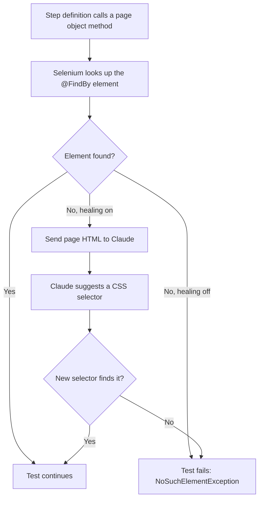
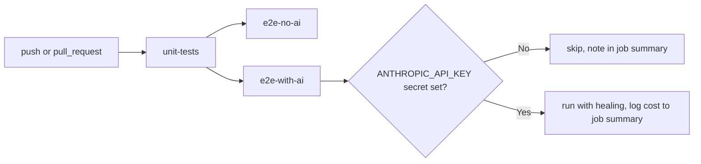
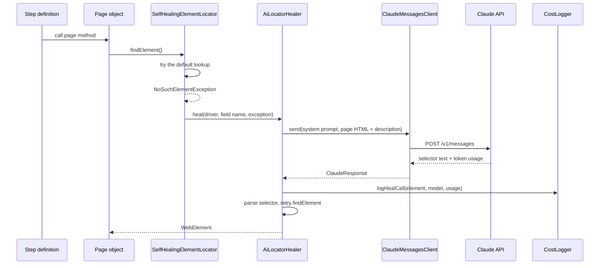

# Modernize framework + example split Implementation Plan

> **For agentic workers:** REQUIRED SUB-SKILL: Use superpowers:subagent-driven-development (recommended) or superpowers:executing-plans to implement this plan task-by-task. Steps use checkbox (`- [ ]`) syntax for tracking.

**Goal:** Split the single-module repo into a `framework` module (driver management, waits, page base class, AI locator healing with cost tracking) that other projects can depend on, and an `example-tests` module that consumes it the way a real user would - plus fix the static-driver thread-safety bug, add unit tests, wire up CI with and without AI healing, and write docs for both a beginner and an expert SDET audience.

**Architecture:** Maven reactor with a parent aggregator POM and two child modules. `framework/src/main/java` holds compile-scope library code; `example-tests/src/test/java` holds the Cucumber glue that depends on it. See `docs/design/2026-07-01-modernize-framework.md` for the full rationale.

**Tech Stack:** Java 21, Maven (multi-module reactor), Selenium 4, Cucumber 7 + TestNG, JUnit 5 + Mockito for framework unit tests, SLF4J, GitHub Actions.

## Global Constraints

- groupId is `com.cucumberbddparallel` everywhere (fixes the existing `cucumberbddprallel` typo) - no code should reference the old groupId or old package `com.cucumberparallel.*` after this plan is done.
- `framework` module code lives under `src/main/java` (compile scope, real library), not `src/test/java`.
- No commit in this plan includes a co-author trailer or "Generated with..." line - attribution is already disabled in `.claude/settings.local.json`.
- Comments and docs should read like a person wrote them: no "leverage/robust/seamless/comprehensive" register, no emoji, short comments only where the *why* isn't obvious from the code.
- Every `git mv` should be used instead of delete+recreate wherever the file content is substantially unchanged, so `git log --follow` still works.
- Default AI model is `claude-sonnet-5` (`AiConfig.DEFAULT_MODEL`), overridable via `ANTHROPIC_MODEL`.

---

### Task 1: Scaffold the Maven reactor

**Files:**
- Modify: `pom.xml` (becomes the parent aggregator)
- Create: `framework/pom.xml`
- Create: `example-tests/pom.xml`
- Modify: `.claude/settings.local.json` is already done, no action needed here
- Commit: `mvnw`, `mvnw.cmd`, `.mvn/wrapper/maven-wrapper.properties` (currently untracked, needed for CI later)

**Interfaces:**
- Produces: three-POM reactor (`cucumberbddparallel-parent`, `framework`, `example-tests`) with all dependency/plugin versions centralized in the parent's `dependencyManagement`/`pluginManagement`. Later tasks add source files into `framework/src/main/java`, `framework/src/test/java`, and `example-tests/src/test/java` - the POMs below already declare every dependency those tasks will need, so nothing here is a placeholder.

- [ ] **Step 1: Create module directories**

```bash
mkdir -p framework/src/main/java framework/src/test/java
mkdir -p example-tests/src/test/java example-tests/src/test/resources/features
```

- [ ] **Step 2: Replace root `pom.xml` with the parent aggregator**

```xml
<?xml version="1.0" encoding="UTF-8"?>
<project xmlns="http://maven.apache.org/POM/4.0.0"
         xmlns:xsi="http://www.w3.org/2001/XMLSchema-instance"
         xsi:schemaLocation="http://maven.apache.org/POM/4.0.0 http://maven.apache.org/xsd/maven-4.0.0.xsd">
    <modelVersion>4.0.0</modelVersion>
    <groupId>com.cucumberbddparallel</groupId>
    <artifactId>cucumberbddparallel-parent</artifactId>
    <packaging>pom</packaging>
    <version>1.0-SNAPSHOT</version>

    <modules>
        <module>framework</module>
        <module>example-tests</module>
    </modules>

    <properties>
        <project.build.sourceEncoding>UTF-8</project.build.sourceEncoding>
        <project.reporting.outputEncoding>UTF-8</project.reporting.outputEncoding>
        <java.version>21</java.version>
        <testng.version>7.12.0</testng.version>
        <cucumber.version>7.34.4</cucumber.version>
        <selenium.version>4.45.0</selenium.version>
        <webdrivermanager.version>6.3.4</webdrivermanager.version>
        <slf4j.version>2.0.17</slf4j.version>
        <junit.jupiter.version>5.11.4</junit.jupiter.version>
        <mockito.version>5.15.2</mockito.version>
        <cucable-plugin.version>1.16.0</cucable-plugin.version>
        <maven.compiler.plugin.version>3.15.0</maven.compiler.plugin.version>
        <maven.surefire.plugin.version>3.5.2</maven.surefire.plugin.version>
        <maven.failsafe.plugin.version>3.5.6</maven.failsafe.plugin.version>
        <maven.build.helper.plugin.version>3.6.1</maven.build.helper.plugin.version>
        <maven.cucumber.reporting.version>5.11.0</maven.cucumber.reporting.version>
        <cluecumber-report-plugin.version>2.9.4</cluecumber-report-plugin.version>
        <failsafe.testFailureIgnore.version>true</failsafe.testFailureIgnore.version>
    </properties>

    <dependencyManagement>
        <dependencies>
            <dependency>
                <groupId>org.seleniumhq.selenium</groupId>
                <artifactId>selenium-java</artifactId>
                <version>${selenium.version}</version>
            </dependency>
            <dependency>
                <groupId>io.github.bonigarcia</groupId>
                <artifactId>webdrivermanager</artifactId>
                <version>${webdrivermanager.version}</version>
            </dependency>
            <dependency>
                <groupId>io.cucumber</groupId>
                <artifactId>cucumber-java</artifactId>
                <version>${cucumber.version}</version>
            </dependency>
            <dependency>
                <groupId>io.cucumber</groupId>
                <artifactId>cucumber-picocontainer</artifactId>
                <version>${cucumber.version}</version>
            </dependency>
            <dependency>
                <groupId>io.cucumber</groupId>
                <artifactId>cucumber-testng</artifactId>
                <version>${cucumber.version}</version>
                <exclusions>
                    <exclusion>
                        <groupId>junit</groupId>
                        <artifactId>junit</artifactId>
                    </exclusion>
                </exclusions>
            </dependency>
            <dependency>
                <groupId>org.testng</groupId>
                <artifactId>testng</artifactId>
                <version>${testng.version}</version>
            </dependency>
            <dependency>
                <groupId>org.slf4j</groupId>
                <artifactId>slf4j-api</artifactId>
                <version>${slf4j.version}</version>
            </dependency>
            <dependency>
                <groupId>org.slf4j</groupId>
                <artifactId>slf4j-simple</artifactId>
                <version>${slf4j.version}</version>
            </dependency>
            <dependency>
                <groupId>org.junit.jupiter</groupId>
                <artifactId>junit-jupiter</artifactId>
                <version>${junit.jupiter.version}</version>
            </dependency>
            <dependency>
                <groupId>org.mockito</groupId>
                <artifactId>mockito-core</artifactId>
                <version>${mockito.version}</version>
            </dependency>
        </dependencies>
    </dependencyManagement>

    <build>
        <pluginManagement>
            <plugins>
                <plugin>
                    <groupId>org.apache.maven.plugins</groupId>
                    <artifactId>maven-compiler-plugin</artifactId>
                    <version>${maven.compiler.plugin.version}</version>
                    <configuration>
                        <source>${java.version}</source>
                        <target>${java.version}</target>
                    </configuration>
                </plugin>
                <plugin>
                    <groupId>org.apache.maven.plugins</groupId>
                    <artifactId>maven-surefire-plugin</artifactId>
                    <version>${maven.surefire.plugin.version}</version>
                </plugin>
            </plugins>
        </pluginManagement>
    </build>
</project>
```

- [ ] **Step 3: Create `framework/pom.xml`**

```xml
<?xml version="1.0" encoding="UTF-8"?>
<project xmlns="http://maven.apache.org/POM/4.0.0"
         xmlns:xsi="http://www.w3.org/2001/XMLSchema-instance"
         xsi:schemaLocation="http://maven.apache.org/POM/4.0.0 http://maven.apache.org/xsd/maven-4.0.0.xsd">
    <modelVersion>4.0.0</modelVersion>
    <parent>
        <groupId>com.cucumberbddparallel</groupId>
        <artifactId>cucumberbddparallel-parent</artifactId>
        <version>1.0-SNAPSHOT</version>
    </parent>

    <artifactId>framework</artifactId>
    <packaging>jar</packaging>

    <dependencies>
        <dependency>
            <groupId>org.seleniumhq.selenium</groupId>
            <artifactId>selenium-java</artifactId>
        </dependency>
        <dependency>
            <groupId>io.github.bonigarcia</groupId>
            <artifactId>webdrivermanager</artifactId>
        </dependency>
        <dependency>
            <groupId>io.cucumber</groupId>
            <artifactId>cucumber-java</artifactId>
        </dependency>
        <dependency>
            <groupId>org.slf4j</groupId>
            <artifactId>slf4j-api</artifactId>
        </dependency>
        <dependency>
            <groupId>org.slf4j</groupId>
            <artifactId>slf4j-simple</artifactId>
            <scope>test</scope>
        </dependency>
        <dependency>
            <groupId>org.junit.jupiter</groupId>
            <artifactId>junit-jupiter</artifactId>
            <scope>test</scope>
        </dependency>
        <dependency>
            <groupId>org.mockito</groupId>
            <artifactId>mockito-core</artifactId>
            <scope>test</scope>
        </dependency>
    </dependencies>
</project>
```

- [ ] **Step 4: Create `example-tests/pom.xml`**

```xml
<?xml version="1.0" encoding="UTF-8"?>
<project xmlns="http://maven.apache.org/POM/4.0.0"
         xmlns:xsi="http://www.w3.org/2001/XMLSchema-instance"
         xsi:schemaLocation="http://maven.apache.org/POM/4.0.0 http://maven.apache.org/xsd/maven-4.0.0.xsd">
    <modelVersion>4.0.0</modelVersion>
    <parent>
        <groupId>com.cucumberbddparallel</groupId>
        <artifactId>cucumberbddparallel-parent</artifactId>
        <version>1.0-SNAPSHOT</version>
    </parent>

    <artifactId>example-tests</artifactId>
    <packaging>jar</packaging>

    <properties>
        <cucable-plugin.sourceFeatures>src/test/resources/features</cucable-plugin.sourceFeatures>
        <cucumber.report.json.location>${project.build.directory}/cucumber-report/</cucumber.report.json.location>
        <generated.report.location>${project.build.directory}/ClucumberReports/</generated.report.location>
        <generated.runner.directory>${project.build.directory}/parallel/runners</generated.runner.directory>
        <generated.feature.directory>${project.build.directory}/parallel/features</generated.feature.directory>
    </properties>

    <build>
        <finalName>cucumbertestngparallel-${project.version}</finalName>
        <plugins>
            <plugin>
                <groupId>com.trivago.rta</groupId>
                <artifactId>cucable-plugin</artifactId>
                <version>${cucable-plugin.version}</version>
                <executions>
                    <execution>
                        <id>generate-test-resources</id>
                        <phase>generate-test-resources</phase>
                        <goals>
                            <goal>parallel</goal>
                        </goals>
                    </execution>
                </executions>
                <configuration>
                    <sourceRunnerTemplateFile>src/test/resources/cucable.template</sourceRunnerTemplateFile>
                    <sourceFeatures>src/test/resources/features</sourceFeatures>
                    <generatedFeatureDirectory>${generated.feature.directory}</generatedFeatureDirectory>
                    <generatedRunnerDirectory>${generated.runner.directory}</generatedRunnerDirectory>
                    <parallelizationMode>features</parallelizationMode>
                    <logLevel>default</logLevel>
                </configuration>
            </plugin>
            <plugin>
                <groupId>org.codehaus.mojo</groupId>
                <artifactId>build-helper-maven-plugin</artifactId>
                <version>${maven.build.helper.plugin.version}</version>
                <executions>
                    <execution>
                        <id>add-test-source</id>
                        <phase>generate-test-sources</phase>
                        <goals>
                            <goal>add-test-source</goal>
                        </goals>
                        <configuration>
                            <sources>
                                <source>${generated.runner.directory}</source>
                            </sources>
                        </configuration>
                    </execution>
                </executions>
            </plugin>
            <plugin>
                <groupId>org.apache.maven.plugins</groupId>
                <artifactId>maven-failsafe-plugin</artifactId>
                <version>${maven.failsafe.plugin.version}</version>
                <executions>
                    <execution>
                        <id>Run parallel tests</id>
                        <phase>integration-test</phase>
                        <goals>
                            <goal>integration-test</goal>
                            <goal>verify</goal>
                        </goals>
                    </execution>
                </executions>
                <configuration>
                    <forkCount>2</forkCount>
                    <testFailureIgnore>true</testFailureIgnore>
                    <includes>
                        <include>**/*IT.class</include>
                        <include>**/*RestIT</include>
                        <include>**/RestITCase</include>
                    </includes>
                </configuration>
            </plugin>
        </plugins>
    </build>

    <profiles>
        <profile>
            <id>integration-test</id>
            <build>
                <plugins>
                    <plugin>
                        <groupId>com.trivago.rta</groupId>
                        <artifactId>cucable-plugin</artifactId>
                        <version>${cucable-plugin.version}</version>
                        <executions>
                            <execution>
                                <id>generate-test-resources</id>
                                <phase>generate-test-resources</phase>
                                <goals>
                                    <goal>parallel</goal>
                                </goals>
                            </execution>
                        </executions>
                        <configuration>
                            <sourceRunnerTemplateFile>src/test/resources/cucable.template</sourceRunnerTemplateFile>
                            <sourceFeatures>${cucable-plugin.sourceFeatures}</sourceFeatures>
                            <generatedFeatureDirectory>${generated.feature.directory}</generatedFeatureDirectory>
                            <generatedRunnerDirectory>${generated.runner.directory}</generatedRunnerDirectory>
                            <parallelizationMode>features</parallelizationMode>
                            <numberOfTestRuns>1</numberOfTestRuns>
                            <logLevel>default</logLevel>
                        </configuration>
                    </plugin>
                    <plugin>
                        <groupId>org.codehaus.mojo</groupId>
                        <artifactId>build-helper-maven-plugin</artifactId>
                        <version>${maven.build.helper.plugin.version}</version>
                        <executions>
                            <execution>
                                <id>add-test-source</id>
                                <phase>generate-test-sources</phase>
                                <goals>
                                    <goal>add-test-source</goal>
                                </goals>
                                <configuration>
                                    <sources>
                                        <source>${generated.runner.directory}</source>
                                    </sources>
                                </configuration>
                            </execution>
                        </executions>
                    </plugin>
                    <plugin>
                        <groupId>org.apache.maven.plugins</groupId>
                        <artifactId>maven-failsafe-plugin</artifactId>
                        <version>${maven.failsafe.plugin.version}</version>
                        <executions>
                            <execution>
                                <id>Run parallel tests</id>
                                <phase>integration-test</phase>
                                <goals>
                                    <goal>integration-test</goal>
                                    <goal>verify</goal>
                                </goals>
                            </execution>
                        </executions>
                        <configuration>
                            <testFailureIgnore>${failsafe.testFailureIgnore.version}</testFailureIgnore>
                            <forkCount>2</forkCount>
                            <reuseForks>true</reuseForks>
                            <argLine>-Dfile.encoding=UTF-8</argLine>
                            <disableXmlReport>true</disableXmlReport>
                            <skipTests>false</skipTests>
                            <includes>
                                <include>**/*IT.class</include>
                                <include>**/*RestIT</include>
                                <include>**/RestITCase</include>
                            </includes>
                        </configuration>
                    </plugin>
                    <plugin>
                        <groupId>com.trivago.rta</groupId>
                        <artifactId>cluecumber-report-plugin</artifactId>
                        <version>${cluecumber-report-plugin.version}</version>
                        <executions>
                            <execution>
                                <id>execution</id>
                                <phase>verify</phase>
                                <goals>
                                    <goal>reporting</goal>
                                </goals>
                            </execution>
                        </executions>
                        <configuration>
                            <sourceJsonReportDirectory>${cucumber.report.json.location}</sourceJsonReportDirectory>
                            <generatedHtmlReportDirectory>${generated.report.location}</generatedHtmlReportDirectory>
                            <customParameters>
                                <Custom_Parameter>${project.artifactId}-${project.version}</Custom_Parameter>
                            </customParameters>
                            <customStatusColorPassed>#017FAF</customStatusColorPassed>
                            <customStatusColorFailed>#C94A38</customStatusColorFailed>
                            <customStatusColorSkipped>#F48F00</customStatusColorSkipped>
                            <customPageTitle>${project.build.finalName}</customPageTitle>
                            <failScenariosOnPendingOrUndefinedSteps>true</failScenariosOnPendingOrUndefinedSteps>
                            <expandBeforeAfterHooks>true</expandBeforeAfterHooks>
                            <expandStepHooks>true</expandStepHooks>
                            <expandDocStrings>true</expandDocStrings>
                            <logLevel>default</logLevel>
                        </configuration>
                    </plugin>
                    <plugin>
                        <groupId>net.masterthought</groupId>
                        <artifactId>maven-cucumber-reporting</artifactId>
                        <version>${maven.cucumber.reporting.version}</version>
                        <executions>
                            <execution>
                                <id>execution</id>
                                <phase>verify</phase>
                                <goals>
                                    <goal>generate</goal>
                                </goals>
                                <configuration>
                                    <projectName>${project.build.finalName}</projectName>
                                    <skip>false</skip>
                                    <outputDirectory>${project.build.directory}</outputDirectory>
                                    <inputDirectory>${cucumber.report.json.location}</inputDirectory>
                                    <jsonFiles>
                                        <param>**/*.json</param>
                                    </jsonFiles>
                                    <classificationDirectory>${project.build.directory}/classifications
                                    </classificationDirectory>
                                    <checkBuildResult>false</checkBuildResult>
                                </configuration>
                            </execution>
                        </executions>
                    </plugin>
                </plugins>
            </build>
        </profile>
    </profiles>

    <dependencies>
        <dependency>
            <groupId>com.cucumberbddparallel</groupId>
            <artifactId>framework</artifactId>
            <version>${project.version}</version>
        </dependency>
        <dependency>
            <groupId>io.cucumber</groupId>
            <artifactId>cucumber-picocontainer</artifactId>
        </dependency>
        <dependency>
            <groupId>org.testng</groupId>
            <artifactId>testng</artifactId>
            <scope>test</scope>
        </dependency>
        <dependency>
            <groupId>io.cucumber</groupId>
            <artifactId>cucumber-testng</artifactId>
        </dependency>
        <dependency>
            <groupId>org.slf4j</groupId>
            <artifactId>slf4j-simple</artifactId>
            <scope>test</scope>
        </dependency>
    </dependencies>
</project>
```

- [ ] **Step 5: Verify the reactor is recognized**

Run: `./mvnw -q validate`
Expected: exits 0, no output (both modules resolve, no source files needed for `validate`).

- [ ] **Step 6: Commit**

```bash
git add pom.xml framework/pom.xml example-tests/pom.xml mvnw mvnw.cmd .mvn/wrapper/maven-wrapper.properties
git commit -m "Split into framework/example-tests Maven reactor"
```

---

### Task 2: Move driver, wait, and page classes into the framework module

**Files:**
- Create: `framework/src/main/java/com/cucumberbddparallel/framework/driver/DriverManager.java`
- Move: `src/test/java/com/cucumberparallel/hookup/driver/Setup.java` -> `framework/src/main/java/com/cucumberbddparallel/framework/driver/Setup.java`
- Move: `src/test/java/com/cucumberparallel/hookup/driver/TearDown.java` -> `framework/src/main/java/com/cucumberbddparallel/framework/driver/TearDown.java`
- Move: `src/test/java/com/cucumberparallel/hookup/driver/Wait.java` -> `framework/src/main/java/com/cucumberbddparallel/framework/wait/Wait.java`
- Move: `src/test/java/com/cucumberparallel/basepage/BasePage.java` -> `framework/src/main/java/com/cucumberbddparallel/framework/page/BasePage.java`

**Interfaces:**
- Produces: `DriverManager.get(): WebDriver`, `DriverManager.set(WebDriver): void`, `DriverManager.quit(): void` - task 3 and task 6's test both use these exact names.
- `BasePage` still exposes `protected WebDriver driver` and `protected Wait wait` fields, used unchanged by page objects in task 7.

- [ ] **Step 1: `git mv` the three driver-hookup files and the page file into place**

```bash
git mv src/test/java/com/cucumberparallel/hookup/driver/Setup.java framework/src/main/java/com/cucumberbddparallel/framework/driver/Setup.java
git mv src/test/java/com/cucumberparallel/hookup/driver/TearDown.java framework/src/main/java/com/cucumberbddparallel/framework/driver/TearDown.java
git mv src/test/java/com/cucumberparallel/hookup/driver/Wait.java framework/src/main/java/com/cucumberbddparallel/framework/wait/Wait.java
git mv src/test/java/com/cucumberparallel/basepage/BasePage.java framework/src/main/java/com/cucumberbddparallel/framework/page/BasePage.java
```

- [ ] **Step 2: Write `DriverManager`**

```java
package com.cucumberbddparallel.framework.driver;

import org.openqa.selenium.WebDriver;

public final class DriverManager {

    private static final ThreadLocal<WebDriver> DRIVER = new ThreadLocal<>();

    private DriverManager() {
    }

    public static WebDriver get() {
        WebDriver driver = DRIVER.get();
        if (driver == null) {
            throw new IllegalStateException("No WebDriver set up for this thread - did the @Before hook run?");
        }
        return driver;
    }

    public static void set(WebDriver driver) {
        DRIVER.set(driver);
    }

    public static void quit() {
        WebDriver driver = DRIVER.get();
        if (driver != null) {
            driver.quit();
            DRIVER.remove();
        }
    }
}
```

- [ ] **Step 3: Rewrite `Setup.java`**

```java
package com.cucumberbddparallel.framework.driver;

import io.cucumber.java.Before;
import io.github.bonigarcia.wdm.WebDriverManager;
import org.openqa.selenium.WebDriver;
import org.openqa.selenium.chrome.ChromeDriver;
import org.openqa.selenium.firefox.FirefoxDriver;

public class Setup {

    @Before
    public void setWebDriver() {
        String browser = System.getProperty("browser");
        if (browser == null) {
            browser = "chrome";
        }
        WebDriver driver = switch (browser) {
            case "chrome" -> {
                WebDriverManager.chromedriver().setup();
                yield new ChromeDriver();
            }
            case "firefox" -> {
                WebDriverManager.firefoxdriver().setup();
                yield new FirefoxDriver();
            }
            default -> throw new IllegalArgumentException("Browser \"" + browser + "\" isn't supported.");
        };
        driver.manage().window().maximize();
        DriverManager.set(driver);
    }
}
```

- [ ] **Step 4: Rewrite `TearDown.java`**

```java
package com.cucumberbddparallel.framework.driver;

import io.cucumber.java.After;
import io.cucumber.java.Scenario;
import org.openqa.selenium.OutputType;
import org.openqa.selenium.TakesScreenshot;
import org.openqa.selenium.WebDriver;

public class TearDown {

    @After
    public void quitDriver(Scenario scenario) {
        WebDriver driver = DriverManager.get();
        if (scenario.isFailed()) {
            saveScreenshotsForScenario(driver, scenario);
        }
        DriverManager.quit();
    }

    private void saveScreenshotsForScenario(WebDriver driver, Scenario scenario) {
        byte[] screenshot = ((TakesScreenshot) driver).getScreenshotAs(OutputType.BYTES);
        scenario.attach(screenshot, "image/png", "screenshot");
    }
}
```

- [ ] **Step 5: Update `Wait.java`'s package line only**

Change line 1 from `package com.cucumberparallel.hookup.driver;` to `package com.cucumberbddparallel.framework.wait;`. Everything else in the file is unchanged (the generic-typed `waitUntilCondition` from the current branch stays as-is).

- [ ] **Step 6: Rewrite `BasePage.java`**

```java
package com.cucumberbddparallel.framework.page;

import com.cucumberbddparallel.framework.ai.AiConfig;
import com.cucumberbddparallel.framework.ai.AiElementLocatorFactory;
import com.cucumberbddparallel.framework.driver.DriverManager;
import com.cucumberbddparallel.framework.wait.Wait;
import org.openqa.selenium.WebDriver;
import org.openqa.selenium.support.PageFactory;
import org.openqa.selenium.support.pagefactory.DefaultElementLocatorFactory;
import org.openqa.selenium.support.pagefactory.ElementLocatorFactory;

public abstract class BasePage {

    protected WebDriver driver;
    protected Wait wait;

    public BasePage() {
        this.driver = DriverManager.get();
        this.wait = new Wait(this.driver);
        ElementLocatorFactory locatorFactory = AiConfig.isHealingEnabled()
                ? new AiElementLocatorFactory(this.driver)
                : new DefaultElementLocatorFactory(this.driver);
        PageFactory.initElements(locatorFactory, this);
    }
}
```

This references `com.cucumberbddparallel.framework.ai.AiConfig` and `AiElementLocatorFactory`, which don't exist yet - that's fine, task 3 creates them before this module compiles again. Don't run a build after this step.

- [ ] **Step 7: Commit**

```bash
git add framework/src/main/java/com/cucumberbddparallel/framework/driver framework/src/main/java/com/cucumberbddparallel/framework/wait framework/src/main/java/com/cucumberbddparallel/framework/page
git commit -m "Move driver/wait/page classes into framework module, add DriverManager"
```

---

### Task 3: Move AI locator classes into the framework module

**Files:**
- Move: `src/test/java/com/cucumberparallel/ai/AiConfig.java` -> `framework/src/main/java/com/cucumberbddparallel/framework/ai/AiConfig.java`
- Move: `src/test/java/com/cucumberparallel/ai/AiElementLocatorFactory.java` -> `framework/src/main/java/com/cucumberbddparallel/framework/ai/AiElementLocatorFactory.java`
- Move: `src/test/java/com/cucumberparallel/ai/AiLocatorHealer.java` -> `framework/src/main/java/com/cucumberbddparallel/framework/ai/AiLocatorHealer.java`

**Interfaces:**
- Produces: `AiConfig.isHealingEnabled(): boolean`, `AiConfig.model(): String` (public, used by `BasePage` and `AiLocatorHealer`), plus package-private `AiConfig.isHealingEnabled(Function<String,String>, Function<String,String>)` and `AiConfig.model(Function<String,String>)` overloads that task 6's `AiConfigTest` calls directly.
- `AiLocatorHealer.heal(WebDriver, String, NoSuchElementException): WebElement` stays the same signature `AiElementLocatorFactory` already calls.

- [ ] **Step 1: `git mv` the three AI files**

```bash
git mv src/test/java/com/cucumberparallel/ai/AiConfig.java framework/src/main/java/com/cucumberbddparallel/framework/ai/AiConfig.java
git mv src/test/java/com/cucumberparallel/ai/AiElementLocatorFactory.java framework/src/main/java/com/cucumberbddparallel/framework/ai/AiElementLocatorFactory.java
git mv src/test/java/com/cucumberparallel/ai/AiLocatorHealer.java framework/src/main/java/com/cucumberbddparallel/framework/ai/AiLocatorHealer.java
```

- [ ] **Step 2: Rewrite `AiConfig.java`** (package rename, default model change, testable seams)

```java
package com.cucumberbddparallel.framework.ai;

import java.util.function.Function;

/**
 * AI self-healing is opt-in and reads its credentials from the environment only -
 * never hardcode an API key or model name here.
 */
public final class AiConfig {

    private static final String DEFAULT_MODEL = "claude-sonnet-5";

    private AiConfig() {
    }

    public static boolean isHealingEnabled() {
        return isHealingEnabled(System::getenv, System::getProperty);
    }

    static boolean isHealingEnabled(Function<String, String> env, Function<String, String> systemProperty) {
        boolean hasApiKey = env.apply("ANTHROPIC_API_KEY") != null;
        boolean optedOut = "false".equalsIgnoreCase(systemProperty.apply("ai.healing.enabled"));
        return hasApiKey && !optedOut;
    }

    public static String model() {
        return model(System::getenv);
    }

    static String model(Function<String, String> env) {
        String override = env.apply("ANTHROPIC_MODEL");
        return override == null || override.isBlank() ? DEFAULT_MODEL : override;
    }
}
```

- [ ] **Step 3: Update `AiElementLocatorFactory.java`'s package line only**

Change line 1 to `package com.cucumberbddparallel.framework.ai;`. The rest of the file (the `SelfHealingElementLocator` inner class, the `ElementLocatorFactory` implementation) is unchanged for this task - task 5 changes what `AiLocatorHealer.heal` does internally, not this file.

- [ ] **Step 4: Update `AiLocatorHealer.java`'s package line only**

Change line 1 to `package com.cucumberbddparallel.framework.ai;`. Leave the rest of the file exactly as it is for now - task 5 splits it apart.

- [ ] **Step 5: Compile the framework module**

Run: `./mvnw -q -pl framework compile`
Expected: exits 0, `framework/target/classes` contains the compiled `driver`, `wait`, `page`, and `ai` packages.

- [ ] **Step 6: Commit**

```bash
git add framework/src/main/java/com/cucumberbddparallel/framework/ai
git commit -m "Move AI locator classes into framework module, default to sonnet"
```

---

### Task 4: Add cost tracking (TokenUsage, ModelPricing, CostCalculator)

**Files:**
- Create: `framework/src/main/java/com/cucumberbddparallel/framework/ai/cost/TokenUsage.java`
- Create: `framework/src/main/java/com/cucumberbddparallel/framework/ai/cost/ModelPricing.java`
- Create: `framework/src/main/java/com/cucumberbddparallel/framework/ai/cost/CostCalculator.java`
- Test: `framework/src/test/java/com/cucumberbddparallel/framework/ai/cost/CostCalculatorTest.java`

**Interfaces:**
- Produces: `TokenUsage(int inputTokens, int outputTokens)` record; `CostCalculator.cost(TokenUsage, String model): Optional<BigDecimal>` - task 5's `CostLogger` (created in that task) calls this exact signature.

- [ ] **Step 1: Write the failing test**

```java
package com.cucumberbddparallel.framework.ai.cost;

import org.junit.jupiter.api.Test;

import java.math.BigDecimal;

import static org.junit.jupiter.api.Assertions.assertEquals;
import static org.junit.jupiter.api.Assertions.assertTrue;

class CostCalculatorTest {

    @Test
    void computesCostForKnownModel() {
        TokenUsage usage = new TokenUsage(1000, 200);

        BigDecimal cost = CostCalculator.cost(usage, "claude-sonnet-5").orElseThrow();

        // 1000 input tokens @ $3/million + 200 output tokens @ $15/million
        BigDecimal expected = new BigDecimal("3.00").multiply(new BigDecimal("1000"))
                .divide(new BigDecimal("1000000"))
                .add(new BigDecimal("15.00").multiply(new BigDecimal("200"))
                        .divide(new BigDecimal("1000000")));
        assertTrue(cost.subtract(expected).abs().compareTo(new BigDecimal("0.000001")) < 0);
    }

    @Test
    void returnsEmptyForUnknownModel() {
        TokenUsage usage = new TokenUsage(1000, 200);

        assertEquals(java.util.Optional.empty(), CostCalculator.cost(usage, "some-future-model"));
    }
}
```

- [ ] **Step 2: Run test to verify it fails**

Run: `./mvnw -q -pl framework test -Dtest=CostCalculatorTest`
Expected: FAIL - compile error, `TokenUsage` and `CostCalculator` don't exist yet.

- [ ] **Step 3: Write `TokenUsage.java`**

```java
package com.cucumberbddparallel.framework.ai.cost;

public record TokenUsage(int inputTokens, int outputTokens) {
}
```

- [ ] **Step 4: Write `ModelPricing.java`**

```java
package com.cucumberbddparallel.framework.ai.cost;

import java.math.BigDecimal;
import java.util.Map;
import java.util.Optional;

/**
 * Dollar-per-million-token rates by model. These are a snapshot, not live
 * data - check https://www.anthropic.com/pricing before using them for
 * real budget planning.
 */
public final class ModelPricing {

    private record Rate(BigDecimal inputPerMillion, BigDecimal outputPerMillion) {
    }

    private static final Map<String, Rate> RATES = Map.of(
            "claude-opus-4-8", new Rate(new BigDecimal("15.00"), new BigDecimal("75.00")),
            "claude-sonnet-5", new Rate(new BigDecimal("3.00"), new BigDecimal("15.00")),
            "claude-haiku-4-5", new Rate(new BigDecimal("0.80"), new BigDecimal("4.00"))
    );

    private ModelPricing() {
    }

    public static Optional<BigDecimal> inputRatePerMillion(String model) {
        return Optional.ofNullable(RATES.get(model)).map(Rate::inputPerMillion);
    }

    public static Optional<BigDecimal> outputRatePerMillion(String model) {
        return Optional.ofNullable(RATES.get(model)).map(Rate::outputPerMillion);
    }
}
```

- [ ] **Step 5: Write `CostCalculator.java`**

```java
package com.cucumberbddparallel.framework.ai.cost;

import java.math.BigDecimal;
import java.math.RoundingMode;
import java.util.Optional;

public final class CostCalculator {

    private static final BigDecimal ONE_MILLION = new BigDecimal("1000000");

    private CostCalculator() {
    }

    public static Optional<BigDecimal> cost(TokenUsage usage, String model) {
        Optional<BigDecimal> inputRate = ModelPricing.inputRatePerMillion(model);
        Optional<BigDecimal> outputRate = ModelPricing.outputRatePerMillion(model);
        if (inputRate.isEmpty() || outputRate.isEmpty()) {
            return Optional.empty();
        }
        BigDecimal inputCost = inputRate.get()
                .multiply(BigDecimal.valueOf(usage.inputTokens()))
                .divide(ONE_MILLION, 6, RoundingMode.HALF_UP);
        BigDecimal outputCost = outputRate.get()
                .multiply(BigDecimal.valueOf(usage.outputTokens()))
                .divide(ONE_MILLION, 6, RoundingMode.HALF_UP);
        return Optional.of(inputCost.add(outputCost));
    }
}
```

- [ ] **Step 6: Run test to verify it passes**

Run: `./mvnw -q -pl framework test -Dtest=CostCalculatorTest`
Expected: PASS, 2 tests run, 0 failures.

- [ ] **Step 7: Commit**

```bash
git add framework/src/main/java/com/cucumberbddparallel/framework/ai/cost framework/src/test/java/com/cucumberbddparallel/framework/ai/cost/CostCalculatorTest.java
git commit -m "Add token usage cost calculation"
```

---

### Task 5: Split AiLocatorHealer and add CostLogger

**Files:**
- Create: `framework/src/main/java/com/cucumberbddparallel/framework/ai/JsonEscaping.java`
- Create: `framework/src/main/java/com/cucumberbddparallel/framework/ai/SelectorResponseParser.java`
- Create: `framework/src/main/java/com/cucumberbddparallel/framework/ai/ClaudeMessagesClient.java`
- Create: `framework/src/main/java/com/cucumberbddparallel/framework/ai/AnthropicHttpClient.java`
- Create: `framework/src/main/java/com/cucumberbddparallel/framework/ai/cost/CostLogger.java`
- Modify: `framework/src/main/java/com/cucumberbddparallel/framework/ai/AiLocatorHealer.java`
- Test: `framework/src/test/java/com/cucumberbddparallel/framework/ai/JsonEscapingTest.java`
- Test: `framework/src/test/java/com/cucumberbddparallel/framework/ai/SelectorResponseParserTest.java`

**Interfaces:**
- Consumes: `CostCalculator.cost(TokenUsage, String)` from task 4.
- Produces: `JsonEscaping.escape(String): String`, `JsonEscaping.unescape(String): String`, `SelectorResponseParser.selectorFrom(String): String`, `ClaudeMessagesClient.send(String system, String userMessage): ClaudeResponse` where `ClaudeResponse` is a record `(String text, TokenUsage usage)`, `CostLogger.logHealCall(String elementName, String model, TokenUsage usage): void`. `AiLocatorHealer.heal(WebDriver, String, NoSuchElementException): WebElement` keeps its existing signature - `AiElementLocatorFactory` (task 3) already calls it and needs no change.

- [ ] **Step 1: Write the failing tests for the pure-logic pieces**

```java
package com.cucumberbddparallel.framework.ai;

import org.junit.jupiter.api.Test;

import static org.junit.jupiter.api.Assertions.assertEquals;

class JsonEscapingTest {

    @Test
    void escapesQuotesBackslashesAndControlChars() {
        String input = "line one\nline \"two\"\\three";

        String escaped = JsonEscaping.escape(input);

        assertEquals("line one\\nline \\\"two\\\"\\\\three", escaped);
    }

    @Test
    void unescapeReversesEscape() {
        String input = "line one\nline \"two\"\\three";

        assertEquals(input, JsonEscaping.unescape(JsonEscaping.escape(input)));
    }
}
```

```java
package com.cucumberbddparallel.framework.ai;

import org.junit.jupiter.api.Test;

import static org.junit.jupiter.api.Assertions.assertEquals;

class SelectorResponseParserTest {

    @Test
    void extractsSelectorFromCodeFence() {
        String reply = "```css\n#new-search-input\n```";

        assertEquals("#new-search-input", SelectorResponseParser.selectorFrom(reply));
    }

    @Test
    void extractsSelectorFromPlainCodeFenceWithoutLanguage() {
        String reply = "```\ninput[name=q2]\n```";

        assertEquals("input[name=q2]", SelectorResponseParser.selectorFrom(reply));
    }

    @Test
    void fallsBackToTrimmedTextWhenNoFence() {
        String reply = "  input[name=q2]  ";

        assertEquals("input[name=q2]", SelectorResponseParser.selectorFrom(reply));
    }
}
```

- [ ] **Step 2: Run tests to verify they fail**

Run: `./mvnw -q -pl framework test -Dtest=JsonEscapingTest,SelectorResponseParserTest`
Expected: FAIL - compile error, `JsonEscaping` and `SelectorResponseParser` don't exist yet.

- [ ] **Step 3: Write `JsonEscaping.java`** (logic moved as-is from the current `AiLocatorHealer`)

```java
package com.cucumberbddparallel.framework.ai;

final class JsonEscaping {

    private JsonEscaping() {
    }

    static String escape(String value) {
        StringBuilder out = new StringBuilder(value.length());
        for (int i = 0; i < value.length(); i++) {
            char c = value.charAt(i);
            switch (c) {
                case '"' -> out.append("\\\"");
                case '\\' -> out.append("\\\\");
                case '\n' -> out.append("\\n");
                case '\r' -> out.append("\\r");
                case '\t' -> out.append("\\t");
                default -> {
                    if (c < 0x20) {
                        out.append(String.format("\\u%04x", (int) c));
                    } else {
                        out.append(c);
                    }
                }
            }
        }
        return out.toString();
    }

    static String unescape(String value) {
        StringBuilder out = new StringBuilder(value.length());
        for (int i = 0; i < value.length(); i++) {
            char c = value.charAt(i);
            if (c == '\\' && i + 1 < value.length()) {
                char next = value.charAt(++i);
                out.append(switch (next) {
                    case '"' -> '"';
                    case '\\' -> '\\';
                    case 'n' -> '\n';
                    case 't' -> '\t';
                    default -> next;
                });
            } else {
                out.append(c);
            }
        }
        return out.toString();
    }
}
```

- [ ] **Step 4: Write `SelectorResponseParser.java`** (logic moved as-is)

```java
package com.cucumberbddparallel.framework.ai;

import java.util.regex.Matcher;
import java.util.regex.Pattern;

final class SelectorResponseParser {

    private static final Pattern CODE_FENCE = Pattern.compile("```(?:css)?\\s*(.+?)\\s*```", Pattern.DOTALL);

    private SelectorResponseParser() {
    }

    static String selectorFrom(String claudeReplyText) {
        Matcher fenced = CODE_FENCE.matcher(claudeReplyText);
        return (fenced.find() ? fenced.group(1) : claudeReplyText).trim();
    }
}
```

- [ ] **Step 5: Run tests to verify they pass**

Run: `./mvnw -q -pl framework test -Dtest=JsonEscapingTest,SelectorResponseParserTest`
Expected: PASS, 5 tests run, 0 failures.

- [ ] **Step 6: Write `ClaudeMessagesClient.java`**

```java
package com.cucumberbddparallel.framework.ai;

import com.cucumberbddparallel.framework.ai.cost.TokenUsage;

interface ClaudeMessagesClient {

    ClaudeResponse send(String system, String userMessage);

    record ClaudeResponse(String text, TokenUsage usage) {
    }
}
```

- [ ] **Step 7: Write `AnthropicHttpClient.java`** (the HTTP call, moved out of `AiLocatorHealer`, now also parsing the `usage` block)

```java
package com.cucumberbddparallel.framework.ai;

import com.cucumberbddparallel.framework.ai.cost.TokenUsage;

import java.io.IOException;
import java.net.URI;
import java.net.http.HttpClient;
import java.net.http.HttpRequest;
import java.net.http.HttpResponse;
import java.time.Duration;
import java.util.Optional;
import java.util.regex.Matcher;
import java.util.regex.Pattern;

final class AnthropicHttpClient implements ClaudeMessagesClient {

    private static final String API_URL = "https://api.anthropic.com/v1/messages";
    private static final String ANTHROPIC_VERSION = "2023-06-01";
    private static final Pattern FIRST_TEXT_BLOCK =
            Pattern.compile("\"type\"\\s*:\\s*\"text\"\\s*,\\s*\"text\"\\s*:\\s*\"((?:\\\\.|[^\"\\\\])*)\"");
    private static final Pattern USAGE_BLOCK = Pattern.compile(
            "\"usage\"\\s*:\\s*\\{\\s*\"input_tokens\"\\s*:\\s*(\\d+)\\s*,\\s*\"output_tokens\"\\s*:\\s*(\\d+)");

    private static final HttpClient CLIENT = HttpClient.newBuilder()
            .connectTimeout(Duration.ofSeconds(10))
            .build();

    @Override
    public ClaudeResponse send(String system, String userMessage) {
        String requestBody = "{"
                + "\"model\":\"" + JsonEscaping.escape(AiConfig.model()) + "\","
                + "\"max_tokens\":256,"
                + "\"system\":\"" + JsonEscaping.escape(system) + "\","
                + "\"messages\":[{\"role\":\"user\",\"content\":\"" + JsonEscaping.escape(userMessage) + "\"}]"
                + "}";

        HttpRequest request = HttpRequest.newBuilder(URI.create(API_URL))
                .header("x-api-key", System.getenv("ANTHROPIC_API_KEY"))
                .header("anthropic-version", ANTHROPIC_VERSION)
                .header("content-type", "application/json")
                .POST(HttpRequest.BodyPublishers.ofString(requestBody))
                .build();

        String responseBody;
        try {
            HttpResponse<String> response = CLIENT.send(request, HttpResponse.BodyHandlers.ofString());
            if (response.statusCode() != 200) {
                throw new IllegalStateException(
                        "Claude API returned HTTP " + response.statusCode() + ": " + response.body());
            }
            responseBody = response.body();
        } catch (IOException | InterruptedException e) {
            throw new IllegalStateException("Failed to call Claude API for locator healing", e);
        }

        String text = firstTextBlock(responseBody)
                .orElseThrow(() -> new IllegalStateException("Claude returned no selector suggestion"));
        return new ClaudeResponse(text, parseUsage(responseBody));
    }

    private static Optional<String> firstTextBlock(String responseJson) {
        Matcher matcher = FIRST_TEXT_BLOCK.matcher(responseJson);
        return matcher.find() ? Optional.of(JsonEscaping.unescape(matcher.group(1))) : Optional.empty();
    }

    private static TokenUsage parseUsage(String responseJson) {
        Matcher matcher = USAGE_BLOCK.matcher(responseJson);
        if (!matcher.find()) {
            return new TokenUsage(0, 0);
        }
        return new TokenUsage(Integer.parseInt(matcher.group(1)), Integer.parseInt(matcher.group(2)));
    }
}
```

- [ ] **Step 8: Write `CostLogger.java`**

```java
package com.cucumberbddparallel.framework.ai.cost;

import org.slf4j.Logger;
import org.slf4j.LoggerFactory;

import java.math.BigDecimal;
import java.util.concurrent.atomic.AtomicReference;

public final class CostLogger {

    private static final Logger LOG = LoggerFactory.getLogger(CostLogger.class);
    private static final AtomicReference<BigDecimal> SESSION_TOTAL = new AtomicReference<>(BigDecimal.ZERO);
    private static volatile boolean shutdownHookRegistered = false;

    private CostLogger() {
    }

    public static void logHealCall(String elementName, String model, TokenUsage usage) {
        registerShutdownHookOnce();
        CostCalculator.cost(usage, model).ifPresentOrElse(
                cost -> {
                    SESSION_TOTAL.updateAndGet(total -> total.add(cost));
                    LOG.info("AI locator heal: element={} model={} in={} out={} cost=${}",
                            elementName, model, usage.inputTokens(), usage.outputTokens(), cost);
                },
                () -> LOG.warn("AI locator heal: element={} model={} in={} out={} cost=unknown, "
                                + "no pricing entry for this model",
                        elementName, model, usage.inputTokens(), usage.outputTokens())
        );
    }

    private static void registerShutdownHookOnce() {
        if (shutdownHookRegistered) {
            return;
        }
        synchronized (CostLogger.class) {
            if (shutdownHookRegistered) {
                return;
            }
            Runtime.getRuntime().addShutdownHook(new Thread(() ->
                    LOG.info("AI locator healing session total: ${}", SESSION_TOTAL.get())));
            shutdownHookRegistered = true;
        }
    }
}
```

- [ ] **Step 9: Rewrite `AiLocatorHealer.java`** to orchestrate the pieces above instead of doing everything itself

```java
package com.cucumberbddparallel.framework.ai;

import com.cucumberbddparallel.framework.ai.cost.CostLogger;
import org.openqa.selenium.By;
import org.openqa.selenium.NoSuchElementException;
import org.openqa.selenium.WebDriver;
import org.openqa.selenium.WebElement;

/**
 * Asks Claude for a replacement CSS selector when a page's declared locator can no
 * longer find its element (e.g. after a markup change), then retries the lookup once.
 */
final class AiLocatorHealer {

    private static final int MAX_PAGE_SOURCE_CHARS = 12_000;
    private static final ClaudeMessagesClient CLIENT = new AnthropicHttpClient();

    private AiLocatorHealer() {
    }

    static WebElement heal(WebDriver driver, String elementDescription, NoSuchElementException cause) {
        String selector = suggestSelector(driver.getPageSource(), elementDescription);
        try {
            return driver.findElement(By.cssSelector(selector));
        } catch (NoSuchElementException healingFailed) {
            cause.addSuppressed(healingFailed);
            throw cause;
        }
    }

    private static String suggestSelector(String pageSource, String elementDescription) {
        String system = "You repair broken Selenium locators. Given a page's HTML and a description of "
                + "the element that could no longer be found, reply with exactly one CSS selector "
                + "that matches the intended element, wrapped in a ``` code fence and nothing else.";
        String userMessage = "Element: " + elementDescription + "\n\nPage HTML:\n" + truncate(pageSource);

        ClaudeMessagesClient.ClaudeResponse response = CLIENT.send(system, userMessage);
        CostLogger.logHealCall(elementDescription, AiConfig.model(), response.usage());
        return SelectorResponseParser.selectorFrom(response.text());
    }

    private static String truncate(String html) {
        return html.length() > MAX_PAGE_SOURCE_CHARS ? html.substring(0, MAX_PAGE_SOURCE_CHARS) : html;
    }
}
```

- [ ] **Step 10: Compile and run the full framework test suite**

Run: `./mvnw -q -pl framework test`
Expected: PASS, no compile errors, all tests from tasks 4 and 5 pass.

- [ ] **Step 11: Commit**

```bash
git add framework/src/main/java/com/cucumberbddparallel/framework/ai framework/src/test/java/com/cucumberbddparallel/framework/ai
git commit -m "Split AiLocatorHealer into testable pieces, log per-call cost"
```

---

### Task 6: Add DriverManager and AiConfig unit tests

**Files:**
- Test: `framework/src/test/java/com/cucumberbddparallel/framework/driver/DriverManagerTest.java`
- Test: `framework/src/test/java/com/cucumberbddparallel/framework/ai/AiConfigTest.java`

**Interfaces:**
- Consumes: `DriverManager.get()/set()/quit()` from task 2, `AiConfig.isHealingEnabled(Function,Function)` and `AiConfig.model(Function)` from task 3.

- [ ] **Step 1: Write the failing `DriverManagerTest`**

```java
package com.cucumberbddparallel.framework.driver;

import org.junit.jupiter.api.AfterEach;
import org.junit.jupiter.api.Test;
import org.openqa.selenium.WebDriver;

import java.util.concurrent.CountDownLatch;
import java.util.concurrent.atomic.AtomicReference;

import static org.junit.jupiter.api.Assertions.assertNotSame;
import static org.junit.jupiter.api.Assertions.assertSame;
import static org.junit.jupiter.api.Assertions.assertThrows;
import static org.mockito.Mockito.mock;

class DriverManagerTest {

    @AfterEach
    void clearThreadLocal() {
        DriverManager.quit();
    }

    @Test
    void throwsWhenNothingHasBeenSetOnThisThread() {
        assertThrows(IllegalStateException.class, DriverManager::get);
    }

    @Test
    void getReturnsWhatWasSetOnTheSameThread() {
        WebDriver driver = mock(WebDriver.class);

        DriverManager.set(driver);

        assertSame(driver, DriverManager.get());
    }

    @Test
    void differentThreadsSeeDifferentDrivers() throws InterruptedException {
        WebDriver mainThreadDriver = mock(WebDriver.class);
        DriverManager.set(mainThreadDriver);

        AtomicReference<WebDriver> otherThreadDriver = new AtomicReference<>();
        CountDownLatch done = new CountDownLatch(1);
        Thread other = new Thread(() -> {
            WebDriver driver = mock(WebDriver.class);
            DriverManager.set(driver);
            otherThreadDriver.set(DriverManager.get());
            done.countDown();
        });
        other.start();
        done.await();

        assertNotSame(mainThreadDriver, otherThreadDriver.get());
        assertSame(mainThreadDriver, DriverManager.get());
    }
}
```

- [ ] **Step 2: Write the failing `AiConfigTest`**

```java
package com.cucumberbddparallel.framework.ai;

import org.junit.jupiter.api.Test;

import java.util.Map;

import static org.junit.jupiter.api.Assertions.assertEquals;
import static org.junit.jupiter.api.Assertions.assertFalse;
import static org.junit.jupiter.api.Assertions.assertTrue;

class AiConfigTest {

    @Test
    void disabledWithNoApiKey() {
        boolean enabled = AiConfig.isHealingEnabled(key -> null, key -> null);

        assertFalse(enabled);
    }

    @Test
    void enabledWithApiKeyAndNoOptOut() {
        boolean enabled = AiConfig.isHealingEnabled(
                key -> "ANTHROPIC_API_KEY".equals(key) ? "sk-ant-test" : null,
                key -> null);

        assertTrue(enabled);
    }

    @Test
    void apiKeyPresentButExplicitlyOptedOut() {
        boolean enabled = AiConfig.isHealingEnabled(
                key -> "ANTHROPIC_API_KEY".equals(key) ? "sk-ant-test" : null,
                key -> "ai.healing.enabled".equals(key) ? "false" : null);

        assertFalse(enabled);
    }

    @Test
    void modelDefaultsToSonnetWhenUnset() {
        assertEquals("claude-sonnet-5", AiConfig.model(key -> null));
    }

    @Test
    void modelUsesOverrideWhenSet() {
        Map<String, String> env = Map.of("ANTHROPIC_MODEL", "claude-haiku-4-5");

        assertEquals("claude-haiku-4-5", AiConfig.model(env::get));
    }
}
```

- [ ] **Step 3: Run tests to verify they fail or pass appropriately**

Run: `./mvnw -q -pl framework test -Dtest=DriverManagerTest,AiConfigTest`
Expected: these should actually PASS immediately since `DriverManager` and the `AiConfig` overloads already exist from tasks 2 and 3 - this task is pure test-writing against existing production code, not new implementation. If anything fails, it means task 2 or 3 wasn't done as specified - go back and check `DriverManager`/`AiConfig` match the code in this plan exactly before continuing.

- [ ] **Step 4: Commit**

```bash
git add framework/src/test/java/com/cucumberbddparallel/framework/driver/DriverManagerTest.java framework/src/test/java/com/cucumberbddparallel/framework/ai/AiConfigTest.java
git commit -m "Add unit tests for DriverManager and AiConfig"
```

---

### Task 7: Move the example test suite into example-tests

**Files:**
- Move: `src/test/java/com/cucumberparallel/homepage/HomePage.java` -> `example-tests/src/test/java/com/cucumberbddparallel/example/homepage/HomePage.java`
- Move: `src/test/java/com/cucumberparallel/homepage/HomePageSteps.java` -> `example-tests/src/test/java/com/cucumberbddparallel/example/homepage/HomePageSteps.java`
- Move: `src/test/java/com/cucumberparallel/searchresultpage/SearchResultPage.java` -> `example-tests/src/test/java/com/cucumberbddparallel/example/searchresultpage/SearchResultPage.java`
- Move: `src/test/java/com/cucumberparallel/searchresultpage/SearchResultPageSteps.java` -> `example-tests/src/test/java/com/cucumberbddparallel/example/searchresultpage/SearchResultPageSteps.java`
- Move: `src/test/java/com/cucumberparallel/runner/HomePageTest.java` -> `example-tests/src/test/java/com/cucumberbddparallel/example/runner/HomePageTest.java`
- Move: `src/test/java/com/cucumberparallel/runner/SearchTest.java` -> `example-tests/src/test/java/com/cucumberbddparallel/example/runner/SearchTest.java`
- Move: `src/test/resources/features/Home_page.feature` -> `example-tests/src/test/resources/features/Home_page.feature`
- Move: `src/test/resources/features/Search.feature` -> `example-tests/src/test/resources/features/Search.feature`
- Move: `src/test/resources/cucable.template` -> `example-tests/src/test/resources/cucable.template`

**Interfaces:**
- Consumes: `com.cucumberbddparallel.framework.page.BasePage` from task 2, `com.cucumberbddparallel.framework.driver.Setup`/`TearDown` from task 2 (referenced by fully-qualified package name in the runners' `glue` array).

- [ ] **Step 1: `git mv` everything**

```bash
git mv src/test/java/com/cucumberparallel/homepage/HomePage.java example-tests/src/test/java/com/cucumberbddparallel/example/homepage/HomePage.java
git mv src/test/java/com/cucumberparallel/homepage/HomePageSteps.java example-tests/src/test/java/com/cucumberbddparallel/example/homepage/HomePageSteps.java
git mv src/test/java/com/cucumberparallel/searchresultpage/SearchResultPage.java example-tests/src/test/java/com/cucumberbddparallel/example/searchresultpage/SearchResultPage.java
git mv src/test/java/com/cucumberparallel/searchresultpage/SearchResultPageSteps.java example-tests/src/test/java/com/cucumberbddparallel/example/searchresultpage/SearchResultPageSteps.java
git mv src/test/java/com/cucumberparallel/runner/HomePageTest.java example-tests/src/test/java/com/cucumberbddparallel/example/runner/HomePageTest.java
git mv src/test/java/com/cucumberparallel/runner/SearchTest.java example-tests/src/test/java/com/cucumberbddparallel/example/runner/SearchTest.java
git mv src/test/resources/features/Home_page.feature example-tests/src/test/resources/features/Home_page.feature
git mv src/test/resources/features/Search.feature example-tests/src/test/resources/features/Search.feature
git mv src/test/resources/cucable.template example-tests/src/test/resources/cucable.template
```

- [ ] **Step 2: Rewrite `HomePage.java`** (package rename, framework import, `System.out.println` replaced with SLF4J)

```java
package com.cucumberbddparallel.example.homepage;

import com.cucumberbddparallel.framework.page.BasePage;
import org.openqa.selenium.Keys;
import org.openqa.selenium.WebElement;
import org.openqa.selenium.support.FindBy;
import org.slf4j.Logger;
import org.slf4j.LoggerFactory;
import org.testng.Assert;

public class HomePage extends BasePage {

    private static final Logger LOG = LoggerFactory.getLogger(HomePage.class);
    private static final String HOME_PAGE_URL = "https://www.google.";

    @FindBy(css = "#hplogo")
    private WebElement logo;

    @FindBy(css = "input[name=q]")
    private WebElement searchInput;

    HomePage() {
    }

    void goToHomePage(String country) {
        driver.get(HOME_PAGE_URL + country);
        wait.forLoading(5);
    }

    void checkLogoDisplay() {
        wait.forElementToBeDisplayed(5, this.logo, "Logo");
    }

    void checkTitle(String title) {
        String displayedTitle = driver.getTitle();
        boolean matches = title.equals(displayedTitle);
        LOG.info("Displayed title is \"{}\" instead of \"{}\": {}", displayedTitle, title, matches);
        Assert.assertTrue(matches);
    }

    void checkSearchBarDisplay() {
        wait.forElementToBeDisplayed(10, this.searchInput, "Search Bar");
    }

    void searchFor(String searchValue) {
        this.searchInput.sendKeys(searchValue);
        this.searchInput.sendKeys(Keys.ENTER);
    }
}
```

- [ ] **Step 3: Update `HomePageSteps.java`'s package line only**

Change line 1 to `package com.cucumberbddparallel.example.homepage;`. No other changes - `HomePage` is in the same package.

- [ ] **Step 4: Rewrite `SearchResultPage.java`** (package rename, framework import, logging cleanup)

```java
package com.cucumberbddparallel.example.searchresultpage;

import com.cucumberbddparallel.framework.page.BasePage;
import org.openqa.selenium.By;
import org.openqa.selenium.WebElement;
import org.openqa.selenium.support.FindBy;
import org.slf4j.Logger;
import org.slf4j.LoggerFactory;
import org.testng.Assert;

import java.util.List;
import java.util.stream.IntStream;

public class SearchResultPage extends BasePage {

    private static final Logger LOG = LoggerFactory.getLogger(SearchResultPage.class);
    private static final String RESULTS_URL_SELECTOR = "cite";

    @FindBy(css = RESULTS_URL_SELECTOR)
    private List<WebElement> results;

    SearchResultPage() {
    }

    void checkExpectedUrlInResults(String expectedUrl, int nbOfResultsToSearch) {
        wait.forPresenceOfElements(5, By.cssSelector(RESULTS_URL_SELECTOR), "Result url");
        int indexOfLink = IntStream.range(0, Math.min(this.results.size(), nbOfResultsToSearch))
                .filter(index -> expectedUrl.equals(this.results.get(index).getText()))
                .findFirst()
                .orElse(-1);
        boolean found = indexOfLink != -1;
        LOG.info("Url \"{}\" wasn't found in the results: {}", expectedUrl, found);
        Assert.assertTrue(found);
    }
}
```

- [ ] **Step 5: Update `SearchResultPageSteps.java`'s package line only**

Change line 1 to `package com.cucumberbddparallel.example.searchresultpage;`.

- [ ] **Step 6: Rewrite `HomePageTest.java`**

```java
package com.cucumberbddparallel.example.runner;

import io.cucumber.testng.AbstractTestNGCucumberTests;
import io.cucumber.testng.CucumberOptions;

@CucumberOptions(
        features = {"src/test/resources/features/Home_page.feature"},
        plugin =
                {"pretty",
                        "json:target/cucumber_json_reports/home-page.json",
                        "html:target/home-page-html"
                },
        glue = {
                "com.cucumberbddparallel.framework.driver",
                "com.cucumberbddparallel.example.homepage"
        })
public class HomePageTest extends AbstractTestNGCucumberTests {
}
```

- [ ] **Step 7: Rewrite `SearchTest.java`**

```java
package com.cucumberbddparallel.example.runner;

import io.cucumber.testng.AbstractTestNGCucumberTests;
import io.cucumber.testng.CucumberOptions;

@CucumberOptions(
        features = {"src/test/resources/features/Search.feature"},
        monochrome = true,
        snippets = CucumberOptions.SnippetType.CAMELCASE,
        plugin = {"pretty",
        "json:target/cucumber_json_reports/search.json",
        "html:target/search-html"},
        glue = {"com.cucumberbddparallel.framework.driver",
                "com.cucumberbddparallel.example.homepage",
                "com.cucumberbddparallel.example.searchresultpage"})
public class SearchTest extends AbstractTestNGCucumberTests {
}
```

- [ ] **Step 8: Feature files and cucable template need no content changes** - they don't reference Java packages.

- [ ] **Step 9: Remove the now-empty old source tree**

```bash
find src -type d -empty -delete
```

(This should remove the emptied `src/test/java/com/cucumberparallel/**` and `src/test/resources/features` directories left behind by the `git mv` calls above. If `src/` still contains files afterward, check for anything that wasn't part of this move before deleting further - don't delete anything not accounted for in this plan.)

- [ ] **Step 10: Compile the reactor**

Run: `./mvnw -q -pl example-tests -am compile`
Expected: exits 0, both `framework` and `example-tests` compile.

- [ ] **Step 11: Commit**

```bash
git add example-tests/src src
git commit -m "Move example page objects/steps/features into example-tests module"
```

---

### Task 8: Full reactor build verification

**Files:** none created - this task is a checkpoint.

- [ ] **Step 1: Run the full reactor build without AI, matching what CI will do**

Run: `./mvnw -q clean verify -Pintegration-test -DskipTests -U`
Expected: exits 0. This resolves all dependencies and runs the `generate-test-resources`/compile phases across both modules (the `-DskipTests` matches what the original README documented, so this doesn't run the live e2e scenarios against google.com - that happens in Task 9's CI job).

- [ ] **Step 2: Run the framework unit test suite by itself**

Run: `./mvnw -q -pl framework test`
Expected: exits 0, all tests from tasks 4, 5, and 6 pass together in one run (checks nothing in task 5 or 6 broke something written earlier).

- [ ] **Step 3: Confirm no old package name survives**

Run: `grep -rl "com.cucumberparallel" --include="*.java" --include="*.xml" . || echo "none found"`
Expected: `none found` - if anything prints before that line, go back and fix the missed reference before moving on.

- [ ] **Step 4: Commit only if Step 3 required a fix**

If Step 3 found and you fixed something:

```bash
git add -u
git commit -m "Fix remaining references to old package/groupId"
```

If Step 3 found nothing, there's nothing to commit - move to Task 9.

---

### Task 9: GitHub Actions CI

**Files:**
- Create: `.github/workflows/ci.yml`

- [ ] **Step 1: Write the workflow**

```yaml
name: CI

on:
  push:
    branches: [test]
  pull_request:

jobs:
  unit-tests:
    runs-on: ubuntu-latest
    steps:
      - uses: actions/checkout@v4
      - uses: actions/setup-java@v4
        with:
          distribution: temurin
          java-version: '21'
          cache: maven
      - run: ./mvnw -B -pl framework test

  e2e-no-ai:
    runs-on: ubuntu-latest
    needs: unit-tests
    steps:
      - uses: actions/checkout@v4
      - uses: actions/setup-java@v4
        with:
          distribution: temurin
          java-version: '21'
          cache: maven
      - run: ./mvnw -B clean verify -Pintegration-test -pl example-tests -am
      - name: Note AI status in job summary
        if: always()
        run: echo "AI locator healing: off, no ANTHROPIC_API_KEY was set for this job." >> "$GITHUB_STEP_SUMMARY"

  e2e-with-ai:
    runs-on: ubuntu-latest
    needs: unit-tests
    env:
      ANTHROPIC_API_KEY: ${{ secrets.ANTHROPIC_API_KEY }}
    steps:
      - uses: actions/checkout@v4
      - name: Skip if no API key secret is configured
        if: ${{ env.ANTHROPIC_API_KEY == '' }}
        run: echo "No ANTHROPIC_API_KEY secret configured - skipping the AI-healing run." >> "$GITHUB_STEP_SUMMARY"
      - uses: actions/setup-java@v4
        if: ${{ env.ANTHROPIC_API_KEY != '' }}
        with:
          distribution: temurin
          java-version: '21'
          cache: maven
      - name: Run with AI healing enabled
        if: ${{ env.ANTHROPIC_API_KEY != '' }}
        run: |
          ./mvnw -B clean verify -Pintegration-test -pl example-tests -am | tee ai-run.log
          echo '### AI locator healing cost' >> "$GITHUB_STEP_SUMMARY"
          echo '```' >> "$GITHUB_STEP_SUMMARY"
          grep -E "AI locator heal|healing session total" ai-run.log >> "$GITHUB_STEP_SUMMARY" || echo "No healing calls happened this run." >> "$GITHUB_STEP_SUMMARY"
          echo '```' >> "$GITHUB_STEP_SUMMARY"
```

- [ ] **Step 2: Verify the YAML parses**

Run: `python3 -c "import yaml, sys; yaml.safe_load(open('.github/workflows/ci.yml')); print('ok')"`
Expected: `ok`. (If `python3`/`pyyaml` isn't available, at minimum open the file and check indentation by eye - a broken workflow file fails silently in the Actions UI rather than erroring locally.)

- [ ] **Step 3: Commit**

```bash
git add .github/workflows/ci.yml
git commit -m "Add CI: unit tests, e2e without AI, e2e with AI healing"
```

---

### Task 10: README.md for the beginner audience

**Files:**
- Modify: `README.md`

- [ ] **Step 1: Rewrite `README.md`**

```markdown
# cucumberBDDParallel

A Cucumber + Selenium 4 + TestNG framework for browser BDD tests, split
into two pieces:

- `framework/` - the reusable part: driver setup/teardown, explicit
  waits, a base page class, and an opt-in AI self-healing locator.
  Depend on this from your own test project the same way
  `example-tests` does.
- `example-tests/` - a working example against google.com, showing
  page objects, step definitions, feature files, and TestNG runners
  built on top of `framework`.

## Requirements

- JDK 21
- Maven 3.9+ (or just use the bundled `./mvnw`)

## Running the example tests

```
./mvnw clean verify -Pintegration-test -pl example-tests -am
```

Browser selection: `-Dbrowser=firefox` (defaults to `chrome`).

## AI self-healing locators

When a page's `@FindBy` locator can no longer find its element (e.g.
after a markup change), the framework can ask Claude for a
replacement CSS selector and retry once before failing the step.

This is **off by default** and only turns on when an API key is
present in the environment - never commit a key to source control:

```
export ANTHROPIC_API_KEY=sk-ant-...
export ANTHROPIC_MODEL=claude-sonnet-5   # optional, this is the default
./mvnw clean verify -Pintegration-test -pl example-tests -am
```

To force it off even with a key present: `-Dai.healing.enabled=false`.

Every healing call logs its token usage and dollar cost. Look for
lines like:

```
AI locator heal: element=searchInput model=claude-sonnet-5 in=1842 out=12 cost=$0.006126
AI locator healing session total: $0.006126
```

See `PLAYBOOK.md` for the pricing table, how CI surfaces this per
run, and how to change the default model.



## Using `framework` in your own project

Add it as a dependency once it's built or published:

```xml
<dependency>
    <groupId>com.cucumberbddparallel</groupId>
    <artifactId>framework</artifactId>
    <version>1.0-SNAPSHOT</version>
</dependency>
```

Then extend `com.cucumberbddparallel.framework.page.BasePage` for your
page objects, wire `com.cucumberbddparallel.framework.driver.Setup`
and `TearDown` into your runner's `glue`, and you get driver
management, waits, and optional AI healing for free. `example-tests`
is a working reference for exactly this setup.

## More detail

`PLAYBOOK.md` covers the architecture decisions, the SOLID reasoning
behind them, the full AI cost model, CI internals, and how to extend
the framework - written for someone who's going to build on this, not
just run it.
```

- [ ] **Step 2: Commit**

```bash
git add README.md
git commit -m "Rewrite README for the framework/example split"
```

---

### Task 11: PLAYBOOK.md for the expert SDET audience

**Files:**
- Create: `PLAYBOOK.md`

- [ ] **Step 1: Write `PLAYBOOK.md`**

```markdown
# Playbook

This is the deep-dive doc. If you just want to run the tests, see
`README.md`. If you're deciding whether to build on this framework,
extend it, or wire it into your own pipeline, keep reading.

## Why the module split

`framework` and `example-tests` are separate Maven modules, not just
separate packages, because a conceptual boundary that isn't enforced
by the build tends to erode - someone adds one convenient import
across the line and the "reusable library" claim stops being true.
With a real module boundary, `example-tests` can only see what
`framework` exposes as public API, the same as any other consumer
would.

## SOLID, concretely

| Principle | Where | Why |
|---|---|---|
| Single Responsibility | `DriverManager` owns driver lifecycle; `Setup` only creates a driver; `TearDown` only tears one down | each class has exactly one reason to change |
| Single Responsibility | `AiLocatorHealer` orchestrates; `ClaudeMessagesClient` does HTTP; `SelectorResponseParser` parses; `JsonEscaping` encodes | each piece is testable and changeable independently, none of them need a live network call to verify |
| Open/Closed | `ModelPricing` is a lookup table, not an if/else chain | adding a model is a one-line map entry, no existing code path changes |
| Liskov Substitution | `AiElementLocatorFactory` and Selenium's `DefaultElementLocatorFactory` both implement `ElementLocatorFactory` | `BasePage` works with either without knowing which one it got |
| Interface Segregation | `ClaudeMessagesClient` exposes exactly the one method callers need | nothing depends on HTTP internals it doesn't use |
| Dependency Inversion | `BasePage` depends on the `ElementLocatorFactory` interface, not a concrete class | the locator strategy can change without touching `BasePage` |

## Depending on `framework` from another repo

Install it locally first:

```
./mvnw -pl framework -am install
```

Then reference it the normal Maven way from your own `pom.xml`:

```xml
<dependency>
    <groupId>com.cucumberbddparallel</groupId>
    <artifactId>framework</artifactId>
    <version>1.0-SNAPSHOT</version>
</dependency>
```

What you get:

- `com.cucumberbddparallel.framework.driver.DriverManager` - thread-local
  `WebDriver` storage. `get()` returns the current thread's driver or
  throws if `Setup`'s `@Before` hook hasn't run yet; `quit()` tears it
  down and clears the thread-local.
- `com.cucumberbddparallel.framework.driver.Setup` / `TearDown` - drop
  these into your runner's `glue` array and you get browser lifecycle
  management (including failure screenshots) without writing it
  yourself.
- `com.cucumberbddparallel.framework.wait.Wait` - three explicit-wait
  helpers: page load, element visibility, presence of a list of
  elements.
- `com.cucumberbddparallel.framework.page.BasePage` - extend this for
  page objects. It wires up `@FindBy` fields via Selenium's
  `PageFactory`, choosing between the default locator and the AI
  healing one automatically based on whether AI is configured.

## The AI cost model

### Pricing table

`com.cucumberbddparallel.framework.ai.cost.ModelPricing` holds:

| Model | Input $/M tokens | Output $/M tokens |
|---|---|---|
| claude-opus-4-8 | 15.00 | 75.00 |
| claude-sonnet-5 | 3.00 | 15.00 |
| claude-haiku-4-5 | 0.80 | 4.00 |

These are a snapshot at the time this table was written, not live
data - check https://www.anthropic.com/pricing before relying on them
for real budget planning, and update the table when they change.

### Why Sonnet is the default

Healing a locator is "read this HTML, return one CSS selector" - not
a task that benefits much from Opus's extra reasoning depth. Sonnet
costs a fifth of Opus per token and handles this fine. Override with
`ANTHROPIC_MODEL=claude-opus-4-8` if you're healing against
unusually complex or ambiguous markup and want the strongest model
available.

### Reading cost locally

Every healing call logs one line through SLF4J:

```
AI locator heal: element=searchInput model=claude-sonnet-5 in=1842 out=12 cost=$0.006126
```

A shutdown hook logs the running total for the JVM when the process
exits:

```
AI locator healing session total: $0.006126
```

### Reading cost in CI

The `e2e-with-ai` job in `.github/workflows/ci.yml` pipes its Maven
output through `grep` for these two log line patterns and writes them
into the job's `$GITHUB_STEP_SUMMARY`, so the dollar cost of that
pipeline run shows up directly on the Actions run summary page - no
need to dig through the full log.

Rough monthly cost at scale: if a pipeline heals N locators per run
and runs M times a day, monthly cost is roughly
`N * M * 30 * (average cost per heal)`. At Sonnet rates, a typical
heal (roughly 2,000 input tokens of page HTML, a few dozen output
tokens) costs well under a cent - the real cost driver is how often
your markup actually changes, not the per-call price.

### Turning it off entirely

No `ANTHROPIC_API_KEY` in the environment means healing never
activates - `AiConfig.isHealingEnabled()` returns `false` and
`BasePage` uses Selenium's plain `DefaultElementLocatorFactory`. If a
key is present but you want to force it off anyway (e.g. a CI job
that has the secret available for other jobs but shouldn't use it
here), pass `-Dai.healing.enabled=false`.

## CI

Three jobs in `.github/workflows/ci.yml`:



- **unit-tests** - `framework`'s JUnit 5 suite. No browser, no
  network, fast. Gates the other two jobs.
- **e2e-no-ai** - the example suite against google.com with no API
  key present. Proves the framework works standalone.
- **e2e-with-ai** - same suite, with `ANTHROPIC_API_KEY` from a repo
  secret. Skips itself gracefully (rather than failing) when the
  secret isn't configured, so forks without the secret don't get a
  red X for something outside their control.

## How a healing call actually works end to end



If the retried lookup also fails, the original
`NoSuchElementException` is rethrown with the healing failure attached
as a suppressed exception - you still get the original stack trace,
plus what the AI tried.

## Extending the framework

- **New page object** - extend `BasePage`, same as `HomePage` and
  `SearchResultPage` do in `example-tests`. `@FindBy` fields get
  wired automatically.
- **New wait condition** - add a method to `Wait` following the
  existing `waitUntilCondition` pattern.
- **New locator strategy beyond AI/default** - `BasePage` currently
  picks between two `ElementLocatorFactory` implementations with a
  ternary. If a third strategy shows up, that's the point to
  introduce a small selection abstraction - not before, since two
  known cases don't justify it yet.

## Known rough edges

- `example-tests` runs against live google.com. It's a demo, not a
  correctness gate on the framework - Google changing their markup
  will break it independently of anything in this repo. Point it at
  your own AUT for real use.
- `ChromeDriver`/`GeckoDriver` versions come from WebDriverManager at
  runtime, so a CI run's browser version can drift over time. Pin a
  specific version in `Setup` if you need reproducible browser
  versions across runs.
```

- [ ] **Step 2: Commit**

```bash
git add PLAYBOOK.md
git commit -m "Add PLAYBOOK for expert SDET audience"
```

---

### Task 12: Final verification pass

**Files:** none created - this task is a checkpoint.

- [ ] **Step 1: Full framework unit suite**

Run: `./mvnw -q -pl framework test`
Expected: exits 0.

- [ ] **Step 2: Full reactor compile + resource generation, no live tests**

Run: `./mvnw -q clean verify -Pintegration-test -DskipTests -U`
Expected: exits 0.

- [ ] **Step 3: Confirm nothing untracked leaked into a commit**

Run: `git status --short`
Expected: no `.claude/`, `.vscode/`, or `target/` directories listed as staged/committed - only genuinely new tracked files should show up here, and they should already be committed from earlier tasks (so this should print nothing, or only files intentionally left uncommitted).

- [ ] **Step 4: Confirm no AI trailer snuck into any commit on this branch**

Run: `git log test..HEAD --format="%B" | grep -i "co-authored-by\|generated with" || echo "clean"`
Expected: `clean`.

- [ ] **Step 5: Read through `README.md` and `PLAYBOOK.md` once as a final human-voice check**

No command - just reread both files. Look for anything that still
reads like a tool wrote it (over-explaining, hedging, "comprehensive",
excessive bullet nesting) and tighten it if so. This is the last
checkpoint before considering the branch done.
